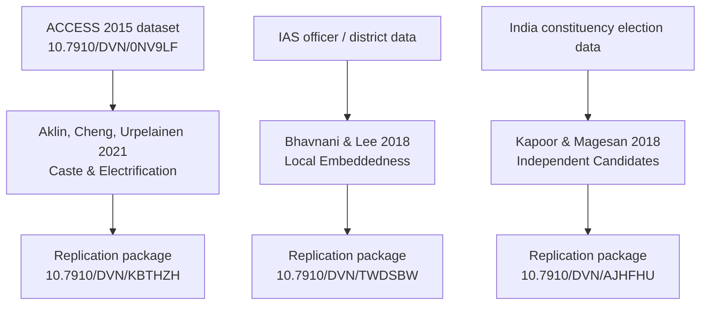

# India-Focused Datasets and Harvard Dataverse Research Guide

## Executive Summary

This audit identifies a strong India data ecosystem in and around Harvard Dataverse, but it is unevenly documented. The most reusable and best-supported materials cluster in three areas: energy-access surveys and follow-on studies, political economy and replication packages from major journals, and demographic or historical reference datasets such as district population estimates and the new century-scale Indian census collection. The strongest replication culture appears in political science and economics journal packages housed in Harvard Dataverse or journal-linked archives such as OpenICPSR and AEA replication infrastructure. citeturn21search1turn25search5turn33search0turn16view0turn28search2turn11search2

For a public-facing “guide to Indian data,” the highest-value records are not necessarily the newest ones. In practical terms, the most website-worthy anchors are the ACCESS 2015 and ACCESS 2018 energy-access surveys, India Residential Energy Survey 2020, the energy gender-perception survey, the district and parliamentary population estimates, the new Indian Census Data Collection 1901–2026, the electoral-criminality dataset, and peer-reviewed replication packages for canonical India papers such as *Independent Candidates and Political Representation in India*, *Inequality in Policy Implementation*, *Local Embeddedness and Bureaucratic Performance*, and *Land Reform, Poverty Reduction, and Growth*. These datasets have stable identifiers, substantial academic reuse, and clear India relevance. citeturn21search1turn25search5turn33search0turn19search6turn30search0turn11search3turn16view1turn14view0turn28search2turn34search0

A major constraint is metadata visibility, not dataset existence. Through the browsing interface available for this audit, many Harvard Dataverse landing pages exposed title, DOI, date, and a minimal description to search engines, but the richer file manifests, variable dictionaries, and explicit license fields were often not machine-readable, and some page opens showed JavaScript or verification blockers. Where the public indexed record did not reveal a license, file formats, code language, or total size, I mark that field as **NR** for “not reported in indexed metadata.” That is itself a useful quality finding for your website: you will want badges for **open**, **mixed/restricted**, and **metadata-incomplete**. citeturn7search0turn7search1turn7search5turn29search3turn29search7

The report therefore does two things at once. It gives a high-confidence catalog of peer-reviewed India papers with accessible replication packages, and it gives a high-coverage inventory of India-focused Harvard Dataverse records identifiable from public web indexing, journal cross-links, and metadata mirrors as of July 9, 2026. Because direct internal Dataverse search was not fully queryable in this environment, treat the Harvard Dataverse inventory as a **high-coverage public crawl**, not a mathematically complete census of every internal metadata match. citeturn29search7turn29search15turn7search0turn8search11

## Scope and Method

I used a narrow inclusion rule for the “dataset papers” catalog: the paper had to be peer reviewed, explicitly India-focused or materially India-using, and connected to a stable data or replication package in Harvard Dataverse or an official journal-linked archive. This favors quality and reproducibility over breadth. Articles that are still working papers, preprints, or have unclear journal status were not treated as confirmed peer-reviewed entries, even when a Harvard Dataverse package exists. citeturn9search0turn9search1turn9search2turn11search0turn34search0turn11search2turn9search7turn10search18turn10search20

For the Harvard Dataverse inventory, I included records where India appeared in the title, in the repository citation text surfaced by search engines, in journal references to a Harvard dataset, or in indexed geographic-coverage descriptions. That method surfaces both stand-alone data resources and replication packages. Harvard Dataverse is a general-purpose research-data repository that hosts datasets, source code, and related files, and re3data’s 2026 profile shows it at global scale, with more than 190,000 datasets and nearly 3.9 million files. citeturn29search3turn29search7turn29search15

Two cautions matter for interpretation. First, many Dataverse pages revealed only partial metadata through indexing, so fields such as license, exact file count, total size, or code language were sometimes unavailable without direct page interaction that the audit interface could not reliably complete. Second, some newer 2025–2026 deposits appear to be highly specific project datasets rather than durable national reference datasets; these are still worth cataloging, but they should be labeled as **project-specific** rather than **core India reference data** on your site. citeturn8search6turn8search19turn8search20turn8search18turn8search21

The notation used below is conservative. **NR** means the field was not recoverable from public indexed metadata. **Inferred** means the content summary is based on the title, abstract, or citing-paper description rather than a full variable list. Citations in the rightmost column support the factual metadata; the short descriptions and tags are editorial recommendations for your website.

## Peer-Reviewed Dataset Papers and Replication Packages

The table below catalogs confirmed peer-reviewed papers with India-facing datasets or replication packages. It prioritizes primary article pages, official journal supplement pages, Harvard Dataverse deposit pages, and journal replication archives.

| Paper and status | Metadata | Data and replication details | Suggested website metadata | Evidence |
|---|---|---|---|---|
| **Local Embeddedness and Bureaucratic Performance: Evidence from India** | **Authors:** Rikhil R. Bhavnani; Alexander Lee. **Year:** 2018. **Paper DOI:** 10.1086/694101. **Repository:** Harvard Dataverse package DOI 10.7910/DVN/TWDSBW. | **Type:** replication package. **License:** NR. **Formats/size:** NR. **Variables:** district-level public-goods outcomes plus IAS officer embeddedness, postings, and career-history variables; the paper says it uses characteristics and career histories of India’s upper bureaucracy over roughly twenty years. **Coverage:** India; district-level; roughly two decades. **Access:** public metadata visible. **Code:** replication package confirmed; language NR. | **Short description:** District panel linking locally embedded IAS officers to public-goods provision. **Tags:** `india`, `bureaucracy`, `politics`, `district-panel`, `replication`. **Recommended citation:** Bhavnani, R.R., and A. Lee. 2018. *The Journal of Politics* 80(1):71–87; replication package DOI 10.7910/DVN/TWDSBW. | citeturn28search2turn28search3turn28search8turn28search0 |
| **Independent Candidates and Political Representation in India** | **Authors:** Sacha Kapoor; Arvind Magesan. **Year:** 2018. **Paper DOI:** 10.1017/S0003055418000199. **Repository:** APSR Dataverse, DOI 10.7910/DVN/AJHFHU. | **Type:** replication package. **License:** NR. **Formats/size:** NR for package; online appendix PDF 439.5 KB. **Variables:** constituency-level counts of independent candidates, turnout, vote shares, coalition outcomes, and ethnic-party outcomes, inferred from abstract and supplement labeling. **Coverage:** India; parliamentary constituencies; election periods around candidate-deposit changes. **Access:** public metadata and supplement link visible. **Code:** replication files explicitly stated; language NR. | **Short description:** Constituency-level election data on independent candidacies, turnout, and representation effects. **Tags:** `india`, `elections`, `political-representation`, `constituencies`, `replication`. **Recommended citation:** Kapoor, S., and A. Magesan. 2018. *American Political Science Review* 112(3):678–697; dataset DOI 10.7910/DVN/AJHFHU. | citeturn15view0turn16view0turn16view1 |
| **Inequality in Policy Implementation: Caste and Electrification in Rural India** | **Authors:** Michaël Aklin; Chao-Yo Cheng; Johannes Urpelainen. **Year:** 2021. **Paper DOI:** 10.1017/S0143814X20000045. **Repository:** Journal of Public Policy Dataverse, DOI 10.7910/DVN/KBTHZH. | **Type:** replication package. **License:** NR. **Formats/size:** package NR; supplementary PDF 6.4 MB. **Variables:** electrification outcomes, caste identifiers or proxies, rural household/service variables, and implementation measures; article cross-references underlying ACCESS survey. **Coverage:** rural India. **Access:** public dataset link visible from article page. **Code:** replication materials explicitly stated; language NR. | **Short description:** Rural electrification and caste inequality dataset and replication materials. **Tags:** `india`, `electricity`, `caste`, `public-policy`, `replication`. **Recommended citation:** Aklin, M., C.-Y. Cheng, and J. Urpelainen. 2021. *Journal of Public Policy* 41(2):331–359; dataset DOI 10.7910/DVN/KBTHZH. | citeturn14view0turn12search0 |
| **Geographic and Socio-Economic Barriers to Rural Electrification: New Evidence from Indian Villages** | **Authors:** Eugenie Dugoua; Ruinan Liu; Johannes Urpelainen. **Year:** 2017. **Paper DOI:** 10.1016/j.enpol.2017.03.048. **Repository:** Harvard Dataverse DOI 10.7910/DVN/K1IUNQ. | **Type:** dataset / replication record. **License:** NR. **Formats/size:** NR. **Variables:** village electrification status, geographic barriers, socio-economic indicators, and political-participation variables, inferred from article abstract and indexed descriptions. **Coverage:** Indian villages. **Access:** public metadata visible. **Code:** no code language visible. | **Short description:** Village-level electrification barriers dataset combining geography and socio-economic conditions. **Tags:** `india`, `villages`, `electrification`, `energy`, `geography`. **Recommended citation:** Dugoua, E., R. Liu, and J. Urpelainen. 2017. *Energy Policy* 106:278–287; dataset DOI 10.7910/DVN/K1IUNQ. | citeturn11search4turn17search3turn17search7turn17search14 |
| **Land Reform, Poverty Reduction, and Growth: Evidence from India** | **Authors:** Timothy Besley; Robin Burgess. **Year:** 2000. **Paper DOI:** 10.1162/003355300554809. **Repository:** Harvard Dataverse DOI 10.7910/DVN/JWRHCK. | **Type:** archived dataset linked to classic peer-reviewed paper. **License:** NR. **Formats/size:** NR. **Variables:** inferred state-level land-reform measures, poverty, growth, and related controls. **Coverage:** India; state-level; post-independence historical panel. **Access:** public metadata visible. **Code:** none visible in indexed metadata. | **Short description:** Canonical state panel on land reform, poverty, and growth in India. **Tags:** `india`, `land-reform`, `poverty`, `growth`, `state-panel`. **Recommended citation:** Besley, T., and R. Burgess. 2000. *Quarterly Journal of Economics* 115(2):389–430; dataset DOI 10.7910/DVN/JWRHCK. | citeturn34search0turn8search3 |
| **Debt Traps? Market Vendors and Moneylender Debt in India and the Philippines** | **Authors:** Dean Karlan; Sendhil Mullainathan; Benjamin N. Roth. **Year:** 2019. **Paper DOI:** 10.1257/aeri.20180030. **Repository:** AEA replication package; OpenICPSR project DOI 10.3886/E116321V1; related Harvard Dataverse record DOI 10.7910/DVN/0KHZMI. | **Type:** peer-reviewed article with official replication archive. **License:** OpenICPSR deposit language does not state review/processing; item distributed “as received.” **Formats/size:** OpenICPSR folder shows `1_India_merged.dta` at **4.2 MB** plus two Philippines `.dta` files. **Variables:** vendor debt, borrowing, loan sources, and market-vendor outcomes. **Coverage:** India and the Philippines. **Access:** public folder listing visible. **Code:** article confirms a replication package exists; code files not visible in the opened India data folder; language NR. | **Short description:** Market-vendor debt microdata with India merged Stata file and official journal replication archive. **Tags:** `india`, `household-finance`, `debt`, `vendors`, `replication`. **Recommended citation:** Karlan, D., S. Mullainathan, and B.N. Roth. 2019. *American Economic Review: Insights* 1(1):27–42; replication archive DOI 10.3886/E116321V1. | citeturn11search2turn13view0turn11search14 |
| **TRIPS, Pharmaceutical Patents, and Generic Competition in India** | **Authors:** Margaret K. Kyle; Bhaven N. Sampat; Kenneth C. Shadlen. **Year:** 2026. **Paper DOI:** 10.1093/haschl/qxaf239. **Repository:** Harvard Dataverse DOI 10.7910/DVN/5V5UOO. | **Type:** replication package. **License:** mixed; paper says public data, analysis code, and replication instructions are available, but IQVIA Ark and MIDAS data are restricted by commercial agreement. **Formats/size:** NR. **Variables:** pharmaceutical patents, generic competition, and market-outcome measures, inferred from title/article. **Coverage:** India; pharmaceutical markets. **Access:** mixed public + restricted inputs. **Code:** explicitly available; language NR. | **Short description:** Patent and generic-competition replication package with mixed public and restricted market data. **Tags:** `india`, `pharma`, `patents`, `health-economics`, `replication`. **Recommended citation:** Kyle, M.K., B.N. Sampat, and K.C. Shadlen. 2026. *Health Affairs Scholar* 4(2):qxaf239; replication DOI 10.7910/DVN/5V5UOO. | citeturn9search7turn9search15turn9search19turn9search11 |
| **Hot Weather, Undernutrition, and Adaptation in Rural India** | **Authors:** Paul Stainier; Manisha Shah; Alan Barreca. **Year:** 2026. **Paper DOI:** 10.1086/739115. **Repository:** Harvard Dataverse DOI 10.7910/DVN/MCUQWV. | **Type:** replication package. **License:** NR. **Formats/size:** NR. **Variables:** rural household nutrition, weather shocks, adaptation behavior, and agricultural-season measures, inferred from article abstract. **Coverage:** rural India. **Access:** public metadata visible. **Code:** repository link visible from article page; code language NR. | **Short description:** Rural India heat-and-nutrition replication package. **Tags:** `india`, `climate`, `nutrition`, `rural`, `replication`. **Recommended citation:** Stainier, P., M. Shah, and A. Barreca. 2026. *Journal of the Association of Environmental and Resource Economists* 13(2):325–354; dataset DOI 10.7910/DVN/MCUQWV. | citeturn10search18turn10search16turn10search13 |
| **Noise and Learning: Evidence from India** | **Authors:** Arzi Adbi; Sumit Agarwal; Pulak Ghosh. **Year:** 2026. **Paper DOI:** 10.1086/742218. **Repository:** Harvard Dataverse DOI 10.7910/DVN/0UVLWW. | **Type:** replication package. **License:** NR. **Formats/size:** NR. **Variables:** noise-pollution measures and academic outcomes, inferred from indexed description and preprint abstract. **Coverage:** India. **Access:** public metadata visible. **Code:** replication package exists; language NR. | **Short description:** India noise-pollution and student-performance replication package. **Tags:** `india`, `education`, `noise`, `environment`, `replication`. **Recommended citation:** Adbi, A., S. Agarwal, and P. Ghosh. 2026. University of Chicago Press article DOI 10.1086/742218; replication DOI 10.7910/DVN/0UVLWW. | citeturn10search4turn10search8turn32search1turn32search8 |

A useful way to think about the best peer-reviewed materials is as a chain: **underlying India dataset → article → replication package**. That pattern is especially clear for energy-access work, bureaucratic-performance work, and electoral-representation work. citeturn14view0turn16view1turn28search3turn21search1

## Harvard Dataverse India Inventory

The next two tables list the **highest-value stand-alone or collection-style Harvard Dataverse records** and then a set of **additional identified India-related Harvard Dataverse records**. Combined with the peer-reviewed table above, these form the working inventory for a public India-data guide.

### Core stand-alone and collection datasets

| Dataset | Metadata | Dataset details | Suggested website metadata | Evidence |
|---|---|---|---|---|
| **Indian Census Data Collection, 1901–2026: Digitised Subnational Population and Administrative Datasets** | **Authors:** Shivakumar Jolad; Madhav Singh. **Year:** 2026. **DOI:** 10.7910/DVN/ON8CP8. | **Repository:** Harvard Dataverse. **License:** not confirmed from indexed metadata. **Formats/size:** indexed records and derivative references indicate codebooks/changelogs in PDF and structured tabular data; exact complete file mix NR. **Variables:** state, district, subdistrict population and administrative identifiers across multiple census rounds. **Coverage:** India, 1901–2026. **Access:** openly accessible according to creators’ announcement. **Code:** none visible on dataset landing metadata. | **Short description:** Long-run harmonized subnational census and administrative dataset for India. **Tags:** `india`, `census`, `demography`, `districts`, `historical-data`. **Recommended citation:** Jolad, S., and M. Singh. 2026. *Indian Census Data Collection, 1901–2026*. Harvard Dataverse. DOI 10.7910/DVN/ON8CP8. | citeturn30search0turn30search1turn30search6turn30search9 |
| **Population Estimates for Districts and Parliamentary Constituencies in India, 2020** | **Authors:** Weiyu Wang; Rockli Kim; S. V. Subramanian. **Year:** 2021. **DOI:** 10.7910/DVN/RXYJR6. | **Repository:** Harvard Dataverse. **License:** NR. **Formats/size:** NR. **Variables:** district and parliamentary-constituency population estimates. **Coverage:** India, 2020. **Access:** public metadata visible. **Code:** none visible. | **Short description:** District and parliamentary constituency population estimates aligned to contemporary Indian geography. **Tags:** `india`, `population`, `districts`, `parliamentary-constituencies`, `demography`. **Recommended citation:** Wang, W., R. Kim, and S.V. Subramanian. 2021. *Population Estimates for Districts and Parliamentary Constituencies in India, 2020*. Harvard Dataverse. DOI 10.7910/DVN/RXYJR6. | citeturn8search15turn19search6turn19search18 |
| **Access to Clean Cooking Energy and Electricity: Survey of States in India (ACCESS 2015)** | **Authors:** Michaël Aklin; Chao-yo Cheng; Karthik Ganesan; Abhishek Jain; Johannes Urpelainen. **Year:** 2016. **DOI:** 10.7910/DVN/0NV9LF. | **Repository:** Harvard Dataverse. **License:** official CEEW page says data may be used freely for non-commercial purposes; verify landing page for exact repository terms. **Formats/size:** NR. **Variables:** household energy access, electricity, cooking fuels, service quality, expenditure, and related socio-economic data. **Coverage:** six energy-poor Indian states; 2015 survey round. **Access:** openly downloadable according to CEEW announcement. **Code:** none visible. | **Short description:** Major household survey on electricity and cooking access in six Indian states. **Tags:** `india`, `energy-access`, `electricity`, `clean-cooking`, `household-survey`. **Recommended citation:** Aklin et al. 2016. *ACCESS 2015*. Harvard Dataverse. DOI 10.7910/DVN/0NV9LF. | citeturn21search1turn21search6turn21search8 |
| **Access to Clean Cooking Energy and Electricity: Survey of States in India 2018 (ACCESS 2018)** | **Authors:** Sunil Mani; Tauseef Shahidi; Sasmita Patnaik; Abhishek Jain; Saurabh Tripathi; Karthik Ganesan; Michaël Aklin; Johannes Urpelainen; Namrata Chindarkar; institutional collaborators. **Year:** 2019. **DOI:** 10.7910/DVN/AHFINM. | **Repository:** Harvard Dataverse. **License:** official CEEW page says data may be used freely for non-commercial purposes; exact repository license NR. **Formats/size:** NR. **Variables:** panel update on energy access and cooking/electricity outcomes. **Coverage:** six Indian states; 2018 follow-up. **Access:** open according to CEEW announcement. **Code:** none visible. | **Short description:** Follow-up panel round for India’s leading multidimensional energy-access survey. **Tags:** `india`, `energy-access`, `panel-data`, `electricity`, `clean-cooking`. **Recommended citation:** Mani et al. 2019. *ACCESS 2018*. Harvard Dataverse. DOI 10.7910/DVN/AHFINM. | citeturn21search1turn21search17 |
| **India Residential Energy Survey (IRES) 2020** | **Authors:** Shalu Agrawal; Sunil Mani; Abhishek Jain; Karthik Ganesan; Johannes Urpelainen. **Year:** 2021. **DOI:** 10.7910/DVN/U8NYUP. | **Repository:** Harvard Dataverse. **License:** NR. **Formats/size:** NR. **Variables:** energy access, consumption, electricity reliability, cooking and heating choices, appliances, and efficiency indicators. **Coverage:** 152 districts in 21 large Indian states covering ~97% of India’s population. **Access:** cited as public Harvard Dataverse dataset. **Code:** none visible. | **Short description:** Pan-India household energy survey on access, reliability, appliances, and fuel use. **Tags:** `india`, `energy`, `survey`, `households`, `electricity`. **Recommended citation:** Agrawal et al. 2021. *India Residential Energy Survey (IRES) 2020*. Harvard Dataverse. DOI 10.7910/DVN/U8NYUP. | citeturn25search5turn25search9turn25search10 |
| **Gender Perception Survey for Energy Access and Use** | **Authors:** Sasmita Patnaik; S. Jha; Alice Tianbo Zhang; Shalu Agrawal; Johannes Urpelainen. **Year:** 2021. **DOI:** 10.7910/DVN/GV85BL. | **Repository:** Harvard Dataverse. **License:** NR. **Formats/size:** NR. **Variables:** gendered energy perceptions, empowerment dimensions, household energy use. **Coverage:** 2,312 rural and urban-slum households across six Indian states. **Access:** Nature Energy article states data are anonymous and publicly available. **Code:** none visible. | **Short description:** Survey on gender perceptions, empowerment, and energy access across six Indian states. **Tags:** `india`, `gender`, `energy-access`, `survey`, `empowerment`. **Recommended citation:** Patnaik et al. 2021. *Gender Perception Survey for Energy Access and Use*. Harvard Dataverse. DOI 10.7910/DVN/GV85BL. | citeturn33search0turn33search2 |
| **Electoral Performance and Criminal Status of Candidates Contesting the 2004 and 2009 Parliamentary Elections to the Lok Sabha** | **Author:** Miriam Golden. **Year:** 2015 distributor version; Harvard Dataverse deposit surfaced 2014. **DOI:** Harvard Dataverse 10.7910/DVN/26863; ICPSR distribution DOI 10.3886/ICPSR35512.v1. | **Repository:** Harvard Dataverse and ICPSR. **License:** NR on Harvard record; ICPSR distribution terms apply through ICPSR. **Formats/size:** NR. **Variables:** candidate-level election results and criminal charges for all Lok Sabha candidates in 2004 and 2009. **Coverage:** India; parliamentary elections 2004 and 2009. **Access:** public metadata. **Code:** none visible. | **Short description:** Candidate-level parliamentary election and criminality data for the 2004 and 2009 Lok Sabha races. **Tags:** `india`, `elections`, `candidates`, `criminality`, `lok-sabha`. **Recommended citation:** Golden, M. 2015. *Electoral Performance and Criminal Status...* ICPSR / Harvard Dataverse DOI. | citeturn11search3turn11search7turn11search11 |
| **TAFSSA District Agrifood Systems Assessment in India 2023** | **Authors:** Avinash Kishore, Suman Chakrabarti, Samuel Scott, Sumanta Neupane, Prakashan C. Veettil, Shreya Chakraborty, Archis Banerjee, Alka Chauhan, Anindya Tomar, Sharvari Patwardhan, Neha Kumar, Mustafa Kamal, Asif Al Faisal, Alison Laing, Afrin Zainab, Anurag Banerjee, Purnima Menon, Timothy Joseph Krupnik, and collaborators. **Year:** 2024. **DOI:** 10.7910/DVN/5MAC6B. | **Repository:** Harvard Dataverse. **License:** field exists, exact value NR. **Formats/size:** NR. **Variables:** household, adolescent, male and female respondent modules plus community questionnaire; food systems, markets, diets, climate risk, natural resources, gender. **Coverage:** Nalanda district, India; fieldwork March–April 2023. **Access:** public metadata visible. **Code:** none visible. | **Short description:** District-level agrifood systems microdata linking production, diets, markets, and resilience in rural Bihar. **Tags:** `india`, `agriculture`, `food-systems`, `district-survey`, `bihar`. **Recommended citation:** Kishore et al. 2024. *TAFSSA District Agrifood Systems Assessment in India 2023*. Harvard Dataverse. DOI 10.7910/DVN/5MAC6B. | citeturn7search9turn19search7 |
| **ASTI India database** | **Authors:** not visible in indexed metadata; repository associated with Agricultural Science and Technology Indicators. **Year:** 2015. **DOI:** 10.7910/DVN/MDNRRV. | **Repository:** Harvard Dataverse. **License:** NR. **Formats/size:** NR. **Variables:** agricultural research system indicators for India, inferred from ASTI documentation. **Coverage:** India; research-system statistics. **Access:** public metadata visible. **Code:** none visible. | **Short description:** India-focused agricultural research-system indicators dataset. **Tags:** `india`, `agriculture`, `research-system`, `asti`, `indicators`. **Recommended citation:** Use repository-supplied citation string on Harvard Dataverse for DOI 10.7910/DVN/MDNRRV. | citeturn8search17turn24search0turn24search19 |
| **Health Survey of Andhra Pradesh, India, 2013** | **Authors:** not exposed in indexed metadata. **Year:** 2014. **DOI:** 10.7910/DVN/26302. | **Repository:** Harvard Dataverse. **License:** NR. **Formats/size:** public file-access wording visible in indexed URL; exact file mix NR. **Variables:** health survey content at family/household level, inferred from title and linked paper references. **Coverage:** Andhra Pradesh, 2013. **Access:** public metadata and public-file hints visible. **Code:** none visible. | **Short description:** State health survey microdata for Andhra Pradesh. **Tags:** `india`, `andhra-pradesh`, `health`, `survey`, `state-data`. **Recommended citation:** Use repository-supplied citation string for DOI 10.7910/DVN/26302. | citeturn8search9turn29search2turn29search6 |
| **India Hyperlocal Newspapers Dataset (IHND)** | **Authors:** not exposed in indexed metadata. **Year:** 2026. **DOI:** 10.7910/DVN/Y9NMGS. | **Repository:** Harvard Dataverse. **License:** NR. **Formats/size:** NR. **Variables:** likely newspaper outlet, issue/article metadata, text, location, and language fields, inferred from title. **Coverage:** India. **Access:** public metadata visible. **Code:** none visible. | **Short description:** Hyperlocal newspaper dataset for India, likely useful for media studies and local-information mapping. **Tags:** `india`, `news`, `local-media`, `text-data`, `newspapers`. **Recommended citation:** Use repository citation for DOI 10.7910/DVN/Y9NMGS. | citeturn6search4turn7search1turn8search11turn19search0 |
| **India-Centric Image–Text Pairs** | **Authors:** indexed mirror lists “Anonymous, Anonymous.” **Year:** 2026. **DOI:** 10.7910/DVN/ABVOEF. | **Repository:** Harvard Dataverse. **License:** NR. **Formats/size:** likely image files plus text metadata; exact file formats and total size NR. **Variables:** image IDs, captions/text pairs, and India-centric labeling, inferred from title. **Coverage:** India-centric corpus. **Access:** public metadata visible. **Code:** none visible. | **Short description:** Multimodal image-and-text corpus centered on Indian content. **Tags:** `india`, `multimodal`, `images`, `text`, `ai-dataset`. **Recommended citation:** Use repository citation for DOI 10.7910/DVN/ABVOEF. | citeturn6search6turn7search0turn19search1turn19search4 |
| **India Renewable Energy Dataset: Solar PV and Wind Capacity, Cost, and Policy Data 2010–2025** | **Authors:** not exposed in indexed metadata. **Year:** 2026. **DOI:** 10.7910/DVN/GJNVJE. | **Repository:** Harvard Dataverse. **License:** NR. **Formats/size:** NR. **Variables:** state or national capacity, costs, and policy variables for solar PV and wind, inferred from title. **Coverage:** India, 2010–2025. **Access:** public metadata visible. **Code:** none visible. | **Short description:** Structured time-series dataset on Indian solar and wind capacity, costs, and policy changes. **Tags:** `india`, `renewable-energy`, `solar`, `wind`, `policy-data`. **Recommended citation:** Use repository citation for DOI 10.7910/DVN/GJNVJE. | citeturn6search9turn8search6 |
| **National and Subnational Estimates of the Covid-19 Reproduction Number for India Based on Test Results** | **Authors:** not exposed in indexed metadata. **Year:** 2021. **DOI:** 10.7910/DVN/PLLOXR. | **Repository:** Harvard Dataverse. **License:** NR. **Formats/size:** NR. **Variables:** national and subnational Covid-19 \(R\) estimates derived from test results. **Coverage:** India; Covid era. **Access:** public metadata visible. **Code:** none visible. | **Short description:** National and subnational Covid-19 reproduction-number estimates for India. **Tags:** `india`, `covid-19`, `epidemiology`, `subnational`, `time-series`. **Recommended citation:** Use repository citation for DOI 10.7910/DVN/PLLOXR. | citeturn6search25turn8search4 |
| **Agriculture in India in the Context of the COVID-19 Pandemic: Cross-Sectional Data from a National Survey** | **Authors:** not exposed in indexed metadata. **Year:** 2022. **DOI:** 10.7910/DVN/YOOU7C. | **Repository:** Harvard Dataverse. **License:** NR. **Formats/size:** NR. **Variables:** national cross-sectional agriculture survey fields, likely production, livelihoods, and pandemic disruptions. **Coverage:** India; Covid period. **Access:** public metadata visible. **Code:** none visible. | **Short description:** National agricultural survey documenting pandemic-period disruptions in India. **Tags:** `india`, `agriculture`, `covid-19`, `national-survey`, `livelihoods`. **Recommended citation:** Use repository citation for DOI 10.7910/DVN/YOOU7C. | citeturn8search16 |
| **Sinophone Borderlands India Survey** | **Authors:** not exposed in indexed metadata. **Year:** 2024. **DOI:** 10.7910/DVN/E8PZBL. | **Repository:** Harvard Dataverse. **License:** license field exists; exact value NR. **Formats/size:** NR. **Variables:** survey variables on India borderland contexts, inferred from title. **Coverage:** India borderlands. **Access:** public metadata visible. **Code:** none visible. | **Short description:** Survey dataset on India’s Sinophone borderland region. **Tags:** `india`, `borderlands`, `survey`, `south-asia`, `regional-data`. **Recommended citation:** Use repository citation for DOI 10.7910/DVN/E8PZBL. | citeturn7search5turn8search10 |
| **Pratham Information Project — Read India** | **Authors:** not exposed in indexed metadata. **Year:** 2009. **DOI:** 10.7910/DVN/CHDLPN. | **Repository:** Harvard Dataverse. **License:** NR. **Formats/size:** NR. **Variables:** likely literacy/education-program indicators tied to the Read India project. **Coverage:** India. **Access:** public metadata visible. **Code:** none visible. | **Short description:** Early education-program dataset associated with Pratham’s Read India initiative. **Tags:** `india`, `education`, `literacy`, `program-data`, `pratham`. **Recommended citation:** Use repository citation for DOI 10.7910/DVN/CHDLPN. | citeturn8search7turn29search1 |

### Additional identified Harvard Dataverse records

These records are still useful for a comprehensive guide, but many are more project-specific, thematically narrower, or poorly indexed for machine extraction.

| Dataset | Metadata | Dataset details | Suggested website metadata | Evidence |
|---|---|---|---|---|
| **Bridge to India Data** | **Year:** 2025. **DOI:** 10.7910/DVN/XTHDEW. **Authors:** not exposed in indexed metadata. | Earth/environment–oriented India data; exact variables, license, formats, size NR. Likely renewable-energy market data from the “Bridge to India” context. Access public metadata visible; code none visible. | **Desc:** Project-specific energy-market dataset for India. **Tags:** `india`, `energy`, `market-data`, `renewables`. **Citation:** repository citation for DOI 10.7910/DVN/XTHDEW. | citeturn6search16turn8search0turn20search1 |
| **Nested Treaties Database: India Treaty Registry v2.0, 1948–2026** | **Year:** 2026. **DOI:** 10.7910/DVN/1YHDXE. | Treaty-registry dataset for India; likely treaty IDs, dates, subject matter, and linkage fields. License/formats/size NR. Public metadata visible. | **Desc:** India treaty-registry reference dataset. **Tags:** `india`, `treaties`, `international-relations`, `legal-data`. | citeturn8search13 |
| **Nested Treaties Database: India Nesting Dataset, Version 1.0** | **Year:** 2026. **DOI:** 10.7910/DVN/Q5WP09. | Related to the treaty registry; likely nesting relationships among treaty instruments. License/formats/size NR. Public metadata visible. | **Desc:** India treaty-nesting relational dataset. **Tags:** `india`, `treaties`, `relational-data`, `international-law`. | citeturn8search2 |
| **Database of Princely States in British India, 1939** | **Year:** 2026. **DOI:** 10.7910/DVN/2ES4C1. **Authors:** authors not exposed in indexed metadata. | Historical territorial dataset documenting provinces and districts / princely states; DataONE mirror description indicates territorial-expansion content. License/formats/size NR. | **Desc:** Historical political geography of princely states in late colonial India. **Tags:** `india`, `history`, `colonial`, `princely-states`, `historical-geography`. | citeturn20search2 |
| **A Detailed Archaeological Dataset of Megalithic Complex at Vindhyan Highlands: A Case Study of Dantari Hill, India** | **Year:** 2025. **DOI:** 10.7910/DVN/R0MUNY. | Archaeological case-study dataset; likely site coordinates, typologies, and feature records. License/formats/size NR. Public metadata visible. | **Desc:** Site-level archaeological dataset for Dantari Hill in the Vindhyan Highlands. **Tags:** `india`, `archaeology`, `heritage`, `spatial-data`. | citeturn6search21turn8search14 |
| **Historical Indian Sugarcane Ecosystem Dataset 2010–2025** | **Year:** 2026. **DOI:** 10.7910/DVN/MSEJ4D. | Project-specific agricultural/environment dataset; likely sugarcane area, production, ecosystem, and market/environment fields. License/formats/size NR. | **Desc:** Indian sugarcane ecosystem time series for agricultural and environmental analysis. **Tags:** `india`, `sugarcane`, `agriculture`, `ecosystem`, `time-series`. | citeturn8search19turn24search2 |
| **Assessing Health System Readiness in Uttar Pradesh, India** | **Year:** 2026. **DOI:** 10.7910/DVN/2GPUTR. | Public-health project dataset tied to immediate kangaroo mother care / service readiness. License/formats/size NR. | **Desc:** Facility or readiness data for maternal-neonatal care systems in Uttar Pradesh. **Tags:** `india`, `uttar-pradesh`, `health-systems`, `maternal-health`. | citeturn8search20 |
| **Avahan-3 Longitudinal Survey** | **Year:** 2019. **DOI:** 10.7910/DVN/APANZO. | Program survey associated with the India AIDS Initiative / Avahan; likely longitudinal respondent and program-outcome files. License/formats/size NR. | **Desc:** Longitudinal survey from the Avahan India AIDS Initiative. **Tags:** `india`, `public-health`, `hiv`, `longitudinal-survey`. | citeturn7search6 |
| **India 2007 Gates Project Behavior Change Impact Survey Round 1** | **Year:** 2014 deposit surfaced. **DOI:** 10.7910/DVN/M9OVIM. | Behavior-change impact survey tied to Gates project. License/formats/size NR. | **Desc:** Program evaluation survey from an India behavior-change intervention. **Tags:** `india`, `survey`, `program-evaluation`, `behavior-change`. | citeturn8search12 |
| **India 2010 TRaC Study for IUD Use Behavior Among Women and Men in 3 Project States** | **Year:** 2014 deposit surfaced. **DOI:** 10.7910/DVN/HGSCBN. | Family-planning / behavior study with three-project-state coverage. License/formats/size NR. | **Desc:** Family-planning behavior survey in three Indian project states. **Tags:** `india`, `reproductive-health`, `survey`, `family-planning`. | citeturn6search5 |
| **Segmentation Data for Nigeria and India States of Bihar, Odisha, and Uttar Pradesh** | **Year:** 2017. **DOI:** 10.7910/DVN/K5NSAF. | Comparative segmentation dataset with explicit India-state coverage. License/formats/size NR. | **Desc:** Segmentation microdata covering Bihar, Odisha, and Uttar Pradesh. **Tags:** `india`, `bihar`, `odisha`, `uttar-pradesh`, `segmentation`. | citeturn8search8 |
| **Cleavages, Party Organization, and Regional Parties in India** | **Year:** 2025. **DOI:** 10.7910/DVN/GTKZEF. | India politics dataset; likely party-level or constituency-level organizational measures. License/formats/size NR. | **Desc:** Party-organization and regional-party dataset for India. **Tags:** `india`, `political-parties`, `regional-parties`, `politics`. | citeturn8search5 |
| **Anchoring India’s Umbrella Species to Biodiversity and Climate Gains** | **Year:** 2025. **DOI:** 10.7910/DVN/MJLOSE. | Ecology/conservation dataset. License/formats/size NR. | **Desc:** Conservation planning dataset connecting umbrella species to biodiversity and climate outcomes in India. **Tags:** `india`, `biodiversity`, `conservation`, `climate`. | citeturn7search7 |
| **Workaholism, Experiential Avoidance and Intolerance of Uncertainty in University Students in India** | **Year:** 2026. **DOI:** 10.7910/DVN/ONF0Y0. | Psychology dataset; likely university-student survey variables. License/formats/size NR. | **Desc:** University-student mental-health and workaholism survey in India. **Tags:** `india`, `students`, `psychology`, `survey-data`. | citeturn8search18 |
| **Stock Market Risk and Return in Crisis: Comparative Evidence from India and South Africa** | **Year:** surfaced in search; DOI 10.7910/DVN/JK2AES. | Comparative finance dataset with India component. License/formats/size NR. | **Desc:** Comparative crisis-period financial dataset including India. **Tags:** `india`, `finance`, `stock-market`, `comparative-data`. | citeturn8search21 |

## Comparative Analysis for Website Design

The easiest way to make this material usable on a website is to separate records by **function**, not just by topic. A user looking for a reusable India data source needs a different signal than a user looking for a journal replication archive. The inventory naturally breaks into four classes: **reference datasets**, **survey microdata**, **project-specific thematic datasets**, and **replication packages**. The first two should sit at the top of your information architecture; the last two should be searchable but labeled more carefully. citeturn21search1turn25search5turn30search0turn19search6turn16view1turn28search3

| Cluster | Representative records | Typical scale | License visibility | Accessibility | Website treatment |
|---|---|---|---|---|---|
| **Reference datasets** | Indian Census Collection; Population Estimates; Electoral Criminality | national, state, district, constituency | often unclear in indexed metadata | usually public metadata, likely open files | put on homepage / “core India data” shelf | citeturn30search0turn19search6turn11search3 |
| **Survey microdata** | ACCESS 2015; ACCESS 2018; IRES 2020; Gender Perception Survey; TAFSSA | household / respondent / district survey | mixed; some external pages describe open or non-commercial reuse | generally public dataset DOIs | feature with “survey” badge and explicit geography/time filters | citeturn21search1turn25search5turn33search0turn19search7 |
| **Project-specific thematic datasets** | India Renewable Energy Dataset; IHND; Image–Text Pairs; Dantari Hill | project- or corpus-specific | mostly unclear | public metadata, file detail uneven | searchable catalog, but not top-level reference spine | citeturn8search6turn19search0turn19search1turn8search14 |
| **Replication packages** | APSR/JPP/JOP/QJE/JAERE-linked India packages | article-analytic scale | often unclear or mixed | usually public metadata; some restricted inputs | separate “replication” badge; emphasize article link and code status | citeturn16view0turn14view0turn28search2turn9search19turn10search18 |

The strongest thematic continuity is in **energy access and household energy use**. ACCESS 2015, ACCESS 2018, IRES 2020, and the energy gender-perception survey together create a credible longitudinal and thematic stack for electricity reliability, cooking fuel use, appliance ownership, and gendered energy outcomes in India. That stack is rare: it combines archived survey data, peer-reviewed reuse, and national or multi-state coverage. citeturn21search1turn25search5turn33search0turn21search17turn25search6

The strongest **replication** culture is in politics and political economy. India-specific or India-heavy replication packages appear in APSR, the *Journal of Public Policy*, *The Journal of Politics*, *Energy Policy*–linked datasets, and older economic classics now archived in Harvard Dataverse. For a research guide, this means you should not only list the dataset DOI but also show whether the record is a “primary dataset” or a “replication bundle built for one article.” citeturn16view1turn14view0turn28search3turn17search3turn8search3

A practical badge system for the website would look like this:

| Badge | Meaning | Typical examples | Recommended UX |
|---|---|---|---|
| **Core reference data** | reusable baseline data for many projects | census collection, population estimates, electoral criminality | show first in search; expose geography and time filters |
| **Survey microdata** | respondent/household/facility data | ACCESS, IRES, TAFSSA, Andhra Pradesh health survey | show sampling footprint and unit of observation prominently |
| **Replication package** | article-specific archive of data/code/docs | AJHFHU, KBTHZH, TWDSBW, 5V5UOO | link paper and package together; separate code from data flags |
| **Mixed/restricted inputs** | some package components restricted | TRIPS package with IQVIA inputs | show warning badge and explain what is public |
| **Metadata incomplete** | license/files/variables not fully surfaced | many newer 2025–2026 entries | allow community notes or curator annotations |

Those last two badges matter because metadata completeness varies widely across the identified records. In an academic setting that is manageable; in a public guide it becomes a discoverability problem unless you label it explicitly. citeturn9search19turn7search0turn8search11turn8search19

## Gaps, Duplicates, and Quality Issues

The single biggest gap is **license visibility**. Many indexed Harvard Dataverse records clearly expose DOI, title, date, and subject, but not the exact license text. Some records show a “License/Data Use Agreement” field in search snippets without revealing the value. For a website intended to guide users toward downloadable India data, this is not just a metadata nicety; it determines who can actually reuse the files. Where possible, your site should store a curator-reviewed license field separately after manual verification of the landing page. citeturn7search5turn7search9turn8search11turn8search20

A second recurring gap is **file manifest quality**. Exact file formats and sizes were often absent in indexed metadata, especially for Harvard Dataverse pages. The main exception in this audit was OpenICPSR, where the India `.dta` file for the *Debt Traps?* replication archive was directly visible at 4.2 MB. That asymmetry suggests your site should distinguish between **repository metadata quality** and **dataset quality**: a valuable dataset can still be hard to document automatically. citeturn13view0turn29search3

There are also important duplicates or near-duplicates that your guide should consolidate. ACCESS 2015 and ACCESS 2018 are related waves of the same survey family, while IRES 2020 and the energy gender-perception survey are adjacent but conceptually distinct follow-ons. Likewise, the India Treaty Registry and India Nesting Dataset are companion outputs from the same treaty-data project, not separate substantive universes. Several public-health program datasets such as the Avahan survey, the Gates behavior-change survey, and the TRaC IUD study are best understood as **program archives**, not general India reference data. citeturn21search1turn25search5turn33search0turn8search13turn8search2turn7search6turn8search12turn6search5

The best way to handle these issues on your site is to create a **family-level grouping** field. A single family page could group ACCESS 2015, ACCESS 2018, IRES 2020, and related papers; another could group India elections and criminality resources; another could group India historical geography and census harmonization. That would reduce clutter, surface continuity across time, and make replication packages easier to interpret in context. citeturn21search1turn25search5turn11search3turn30search0

The newest deposits are promising but require caution. Datasets such as the India Hyperlocal Newspapers Dataset, India-Centric Image–Text Pairs, India Renewable Energy Dataset, Historical Indian Sugarcane Ecosystem Dataset, and several 2026 niche deposits make Harvard Dataverse look increasingly important for India-facing computational and domain-specific work. But many of these deposits are newly indexed and not yet richly connected to peer-reviewed reuse or robust machine-readable metadata. On your site they should be included, but marked as **new / metadata-light** until checked manually. citeturn6search4turn6search6turn8search6turn8search19turn8search18

Open questions and limitations remain. This report is high-confidence on the items listed, but it is not guaranteed exhaustive for every internal Harvard Dataverse metadata match because direct internal Dataverse querying was not fully available in this audit interface. The most likely missing records are those where India appears only in deep metadata fields that search engines did not surface. The most likely incomplete fields in the tables above are exact license strings, full file-format inventories, total data size, and programming language of replication code when the package exists but the file manifest was not visible. citeturn29search7turn7search0turn8search11