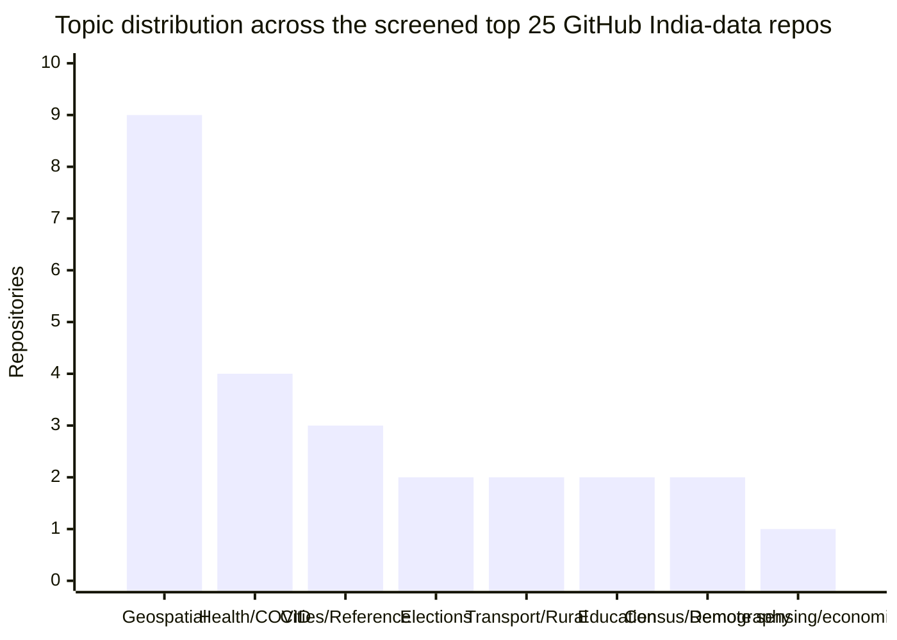
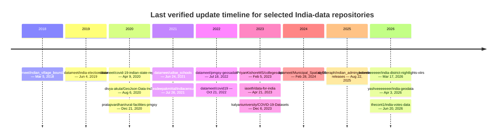

# GitHub Hosted Datasets About India

## Executive Summary

GitHub hosts a substantial but highly uneven ecosystem of India-related datasets. In the screened set most useful for a public-facing “guide to Indian data,” geospatial and boundary repositories dominate, led by DataMeet’s long-running map projects, newer release-driven collections such as `yashveeeeeeer/india-geodata`, and boundary compendia like `ramSeraph/indian_admin_boundaries` and `datta07/INDIAN-SHAPEFILES`. Elections, COVID-era archives, education directories, census derivatives, and city/reference JSON repositories form the next most important clusters. citeturn16view0turn18view0turn17search1turn19view0turn11search8turn18view1turn28search1turn24search5

For your website, the highest-value repositories are not simply the most starred ones. The strongest homepage candidates are the repos that combine open machine-readable formats, clear provenance, usable access patterns, and explicit reuse clues: `datameet/maps`, `datameet/Municipal_Spatial_Data`, `yashveeeeeeer/india-geodata`, `ramSeraph/indian_admin_boundaries`, `datta07/INDIAN-SHAPEFILES`, `thecont1/india-votes-data`, `iaseth/data-for-india`, `PriyanKishoreMS/colleges-api`, `pratapvardhan/rural-facilities-pmgsy`, and `yashveeeeeeer/india-district-nightlights-viirs`. Those ten cover the clearest mix of boundaries, elections, education, rural infrastructure, reference directories, and newer economic-proxy data. citeturn16view0turn12search20turn18view0turn17search5turn19view0turn18view1turn24search5turn13search1turn28search0turn40view0

A central finding is that “license compatibility” must be treated as a two-layer problem. Many repositories expose permissive repo-level licenses, but the upstream data may come from official Indian portals, third-party geodata projects, or mixed-source scrapes whose terms do not fully match the repository’s software license. Government open data on Indian official portals is generally released under the Government Open Data License India, but Census, ECI, Survey of India, UDISE+, and mixed-source mirrors all need source-level checks before you display a green “safe to reuse” badge. citeturn22search11turn22search27turn22search28turn23search23turn23search2turn18view0turn17search5turn34view0

Freshness is also highly uneven. Some classic repos remain useful but are clearly archival or sunsetted, such as `datameet/covid19` and `datameet/india-election-data`, while a newer generation is actively maintained into 2025–2026, including `india-geodata`, `india-district-nightlights-viirs`, `india-votes-data`, and `ramSeraph/indian_admin_boundaries` releases. A good data-guide website should therefore surface recency and maintenance state as prominently as topic and license. citeturn16view0turn11search8turn21search2turn8view0turn20search18turn17search5

## Scope and Method

This report is a curated best-effort survey, not a literal enumeration of every public GitHub repository touching Indian data. GitHub’s `india` topic page alone surfaced more than 2,400 public repositories, while the narrower `india-data` topic surfaced only a handful of more directly relevant entries. I therefore prioritized repositories that actually host datasets, release artifacts, or machine-readable data files about India, and de-prioritized code-only dashboards, notebooks that merely consume external APIs, and general awesome-lists. citeturn12search15turn25search7

The search strategy centered on GitHub repo pages, topic pages, organization pages, and project documentation, especially DataMeet, University of Kalyani, Development Data Lab, Yash V., RamSeraph, and smaller niche maintainers. I cross-checked mirrored repositories against official Indian sources where the repo itself claimed to mirror or transform government data, especially data.gov.in, Census India, ECI, UDISE+, and PMGSY. citeturn16view0turn35search0turn36search1turn18view0turn17search1turn22search11turn22search28turn23search23turn23search2turn22search3

A practical constraint is that GitHub’s public HTML/search rendering does not reliably expose every field for every repo. Where possible, I recorded precise last-update dates, stars, forks, commit counts, and issue counts from GitHub pages. Where the current HTML view did not expose a field cleanly, I mark it as “not surfaced” rather than guessing. For “size,” I recorded visible file sizes, row counts, or release-scale signals when the full repo size was not directly displayed. This is the most defensible approach for a guide aimed at user trust. citeturn32search15turn32search16turn26search13turn40view0turn28search0

Official provenance still matters because the best GitHub repos usually add value by normalizing, packaging, documenting, or releasing friendlier artifacts on top of government systems that are harder to search or consume directly. Census India publishes tables and population-finder tools, ECI publishes official result and statistical-report portals, UDISE+ is the official school-information system, and data.gov.in carries Government Open Data License India terms for many public-sector datasets and APIs. citeturn22search1turn22search5turn23search23turn23search0turn23search2turn22search11turn22search27

## Landscape of the Repositories

In this screened set, geospatial repositories are the single largest category, but they are not a majority. They account for 9 of the 25 repositories below, followed by health/COVID with 4; city/reference data with 3; and elections, transport/rural infrastructure, education, and census/demography with 2 each. That means a map-heavy UX will be valuable, but your homepage taxonomy should still be broader than “maps.” The better framing is “India datasets, with geospatial as the deepest subcategory.” This synthesis is based on the repository comparison below. citeturn16view0turn18view0turn17search1turn19view0turn18view1turn24search5turn28search1turn27search3turn39search3

The category split also points to three structurally different repo types. First, there are “community infrastructure” repos, especially from DataMeet, where the repo is both a data host and a civic-maintenance vehicle. Second, there are “packaging repos” that convert raw or awkward public data into cleaner JSON, CSV, GeoJSON, or API forms. Third, there are “research and derivative repos” that generate new panels or harmonized products from multiple official sources, such as nighttime-lights panels, COVID harmonization layers, or release bundles of administrative boundaries. citeturn16view0turn24search5turn40view0turn17search5turn24search3

One implication for your website is that users will care about provenance differently by category. Boundary files, postal shapes, and election panels need “official source” metadata; education and college datasets need “coverage and staleness” metadata; and COVID repos increasingly need “historical archive only” badges rather than “actively maintained” labels. The website should therefore not flatten all repos into one generic card template. citeturn22search28turn23search23turn23search2turn16view0turn13search1turn24search6

## Comparison of Leading Repositories

The table below compares the 25 repositories most useful for an India-data guide. “Reuse fit” is my editorial assessment of whether a public directory can reasonably present the repository as reusable without significant caveats.

| Repository | Maintainer | License | Last verified update and popularity | Primary topics | Formats and access | Quality, activity, provenance | Reuse fit |
|---|---|---|---|---|---|---|---|
| [datameet/maps](https://github.com/datameet/maps) | DataMeet | CC BY 4.0 repo badge; individual datasets may vary | Update date not cleanly surfaced in current HTML; 459 stars / 407 forks | Geospatial, admin boundaries, electoral maps | Shapefile-first; raw files; project site on GitHub Pages | Strong discoverability and project docs; DataMeet’s map site exists precisely to document fields, formats, license, and references for map projects. citeturn16view0turn7search3turn7search4 | Good for discovery; verify per-dataset upstream terms |
| [datameet/Municipal_Spatial_Data](https://github.com/datameet/Municipal_Spatial_Data) | DataMeet | Not surfaced in current GitHub HTML | Updated Feb 28, 2024; 147 stars / 182 forks | Urban governance, wards, municipalities | Raw spatial files; project site | Useful municipal-ward collection; good visibility; 29 issues and 1 PR suggest real maintenance/use. citeturn16view0turn12search20 | Conditional; show provenance/source-city clearly |
| [datameet/india-election-data](https://github.com/datameet/india-election-data) | DataMeet | Mixed: datasets under respective licenses; docs under CC BY-SA 3.0 | Updated Jun 4, 2019; 162 stars / 119 forks | Elections, Lok Sabha, political data | Primarily README-driven mapping of public datasets; raw repo docs | Important historical election map/catalog, but license is explicitly mixed and maintenance is older. citeturn16view0turn11search8turn12search16 | Conditional; excellent guide resource, weaker as a single reusable dataset |
| [datameet/covid19](https://github.com/datameet/covid19) | DataMeet | Not surfaced in current HTML | Updated Oct 21, 2022; 122 stars / 109 forks | COVID, health, archival public-health data | Raw files and backups | Explicitly sunsetted on 2022-10-21; still valuable historically, not for live use. citeturn16view0 | Historical-only |
| [datameet/indian_village_boundaries](https://github.com/datameet/indian_village_boundaries) | DataMeet | ODbL | Updated Mar 5, 2018; 78 stars / 58 forks | Villages, rural boundaries, geospatial | Raw files plus project website | Strong attribution guidance and issue workflow; still important but older and incomplete in places. citeturn9search1turn11search6turn11search0turn16view0 | Share-alike; very useful with ODbL badge |
| [datameet/pmgsy-geosadak](https://github.com/datameet/pmgsy-geosadak) | DataMeet | Not surfaced; official-source mirror should be checked | Updated Jul 18, 2022; 14 stars / 15 forks | Rural roads, transport, geospatial | Raw files / project-style repo | Clearly framed as PMGSY National GIS open data; valuable official mirror but less documented than the best DataMeet repos. citeturn16view0turn22search3 | Conditional; strong provenance, weaker documentation |
| [datameet/udise_schools](https://github.com/datameet/udise_schools) | DataMeet | Not surfaced in current HTML | Updated Jun 24, 2021; 9 stars / 3 forks | Education, schools, geocoded schooling data | Raw data folders and scripts | Good field-level column documentation; community notes indicate about 14 lakh schools. citeturn28search1turn30search4turn11search0turn30search18 | Conditional; useful but needs source/license signage |
| [datameet/indian-district-boundaries](https://github.com/datameet/indian-district-boundaries) | DataMeet | MIT | Updated May 27, 2020; 44 stars / 57 forks | District boundaries, topojson/geojson | Raw files | Useful for visualization; district names follow Registrar General naming and completeness has caveats. citeturn30search0turn30search1 | Good for visualization; note boundary caveats |
| [datameet/covid-19-indian-state-reports](https://github.com/datameet/covid-19-indian-state-reports) | DataMeet | Not surfaced in current HTML | Updated Apr 9, 2020; 5 stars / 2 forks | COVID, state bulletins, health archives | PDFs and images, raw archive folders | 57 commits; valuable provenance because it preserves bulletins from many state-government sources. citeturn28search3turn11search0 | Historical archive only |
| [iaseth/data-for-india](https://github.com/iaseth/data-for-india) | iaseth | MIT | Updated Apr 21, 2023; 15 stars / 1 fork | Districts, states, reference JSON | JSON raw files; npm-style package metadata | Small but clean and useful for product teams needing lookup/reference data rather than heavyweight analytics. citeturn24search5turn24search8turn25search7 | Good, especially for web-app reference use |
| [Vynex/indian-cities-geodata](https://github.com/Vynex/indian-cities-geodata) | Vynex | Apache-2.0 | Precise update date not surfaced; 16 stars / 4 forks | Cities, geodata, population, coordinates | JSON raw file | README gives field schema and cites Census India, BSNL, Google Maps, and Wikipedia as inputs; mixed upstream provenance despite permissive repo license. citeturn24search4turn39search1 | Conditional; good if you disclose mixed sources |
| [recurze/IndianCities](https://github.com/recurze/IndianCities) | recurze | License not surfaced in current HTML | Precise update date not surfaced; 4 stars / 2 forks | Cities, districts, states, demography | CSV plus Python helper module | Transparent about data sources and gaps; `india_places.csv` is visible at 1,298 rows / 61.7 KB. citeturn32search1turn32search16 | Conditional; useful, but license ambiguity matters |
| [PriyanKishoreMS/colleges-api](https://github.com/PriyanKishoreMS/colleges-api) | Priyan Kishore M. S. | License not surfaced in current HTML | Updated Feb 5, 2023; 9 stars / 1 fork | Education, colleges, AISHE-derived directory | API, CSV, SQL dump | Strong practical usability: 43,000 colleges; explicit API endpoints; but README says hosted RDS is discontinued and repo is unmaintained. citeturn13search1turn38search1turn39search2 | Good for archival download; badge as stale/unmaintained |
| [yashveeeeeeer/india-geodata](https://github.com/yashveeeeeeer/india-geodata) | yashveeeeeeer | CC BY 4.0 repo badge; dataset-level licenses vary | Updated Apr 3, 2026 on topic page; 59 stars / 6 forks; latest release Mar 16, 2026 | Geospatial, census, electoral, environment, pmtiles | GitHub Releases, GitHub Pages download portal, multiple file types | One of the strongest modern repos: 55+ datasets, explicit format/license per dataset on portal, release workflow, legal notice, and examples with visible sizes. citeturn18view0turn21search2turn26search13 | Excellent, but always display upstream license separately |
| [yashveeeeeeer/india-district-nightlights-viirs](https://github.com/yashveeeeeeer/india-district-nightlights-viirs) | yashveeeeeeer | MIT for code; upstream NOAA/DataMeet/source terms apply to data inputs | Updated Mar 17, 2026; 13 stars / 0 forks | Remote sensing, economics, urbanization | Built CSV and year-wise GeoJSON; reproducible pipeline | High-quality README, explicit output schema, disk-space requirement (~2 GB), and 8,333-row panel description. citeturn40view0turn8view0 | Very good for researchers and analysts |
| [ramSeraph/indian_admin_boundaries](https://github.com/ramSeraph/indian_admin_boundaries) | ramSeraph | Repo license not surfaced; many release assets labeled CC0 1.0 with attribution ask | Release activity through Aug 22, 2025; 39 stars / 13 forks | Administrative boundaries, historical districts, postal, forest, coastal, police | GitHub Releases, vector tiles, release assets | Best-in-class release packaging and provenance notes; release pages name sources such as LGD/Bharatmaps, Survey of India, and Bhuvan. citeturn17search1turn17search5turn20search3turn20search7 | Excellent if you track asset-level licenses |
| [udit-001/india-maps-data](https://github.com/udit-001/india-maps-data) | udit-001 | License not surfaced in current HTML | Exact update date not surfaced; 49 stars / 15 forks | GeoJSON, TopoJSON, state and district maps | Raw files, CDN links via jsDelivr, interactive preview site | Helpful delivery layer for web developers; 63 commits and direct CDN links are a major UX advantage. citeturn18view2turn20search1 | Good for front-end consumption; provenance less explicit than top geospatial repos |
| [datta07/INDIAN-SHAPEFILES](https://github.com/datta07/INDIAN-SHAPEFILES) | datta07 | MIT | Exact repo update date not surfaced; 233 stars / 146 forks | GeoJSON, admin boundaries, highways, railways, metros | Raw files | Very high visibility and broad coverage; good README and issue activity, but provenance still needs source-level checks. citeturn19view0turn19view2turn20search12 | Strong candidate; show “source mixed/verify” badge |
| [thecont1/india-votes-data](https://github.com/thecont1/india-votes-data) | thecont1 | MIT | Updated Jun 20, 2026; 8 stars / 0 forks | Elections, candidates, parliamentary and assembly results | SQLite/PostgreSQL pipeline, optional CSV/JSON export, dashboard | Excellent modern fit for a guide site: normalized schema, export options, explicit ECI provenance, active through 2026. citeturn18view1turn20search18turn20search6 | Excellent |
| [pratapvardhan/rural-facilities-pmgsy](https://github.com/pratapvardhan/rural-facilities-pmgsy) | Pratap Vardhan | GODL-India for data; visuals CC BY 4.0 | Last updated Dec 21, 2020 in README; 40 stars / 15 forks; latest release Mar 5, 2021 | Rural facilities, agriculture, education, medical, transport/admin | State CSVs in repo; combined India dataset noted as 120 MB | Strong when you need rural POI-style data; README includes caveats and explicit government source reference. citeturn28search0turn22search3 | Good with attribution and freshness warning |
| [devdatalab/covid](https://github.com/devdatalab/covid) | Development Data Lab | License not surfaced in current HTML | Latest visible commit rendered as about 4 years ago; 43 stars / 18 forks | COVID, health-system capacity, demography, socioeconomic linkages | Raw files and documentation; linked project site | Rich research-grade harmonization repo, but not a live public API and not clearly licensed for broad redistribution. citeturn24search3turn36search7turn36search5 | Conditional; best as a cited research resource |
| [kalyaniuniversity/COVID-19-Datasets](https://github.com/kalyaniuniversity/COVID-19-Datasets) | University of Kalyani | GPL-3.0 plus academic-research-only terms in README | Updated Dec 6, 2023; 18 stars / 4 forks | COVID, statewise cases, deaths, recoveries | Raw folders, scripts, visualization link | Heavy commit history (2,009 commits) and clear scope, but README restricts use to education/academic research and prohibits commercial reliance. citeturn34view0turn35search0turn35search1 | Research-only; do not badge as generally reusable |
| [yesdeepakmittal/indiacensus](https://github.com/yesdeepakmittal/indiacensus) | yesdeepakmittal | MIT | Updated Jul 26, 2021; 3 stars / 2 forks | Census, gender, rural/urban, disability, sex ratio | Notebook-based analysis repo | Useful smaller derivative repo with Census India source noted, but more analysis-oriented than canonical data packaging. citeturn27search3turn38search4 | Conditional; useful secondary layer |
| [mihirs16/Census-of-India-2011-Dataset](https://github.com/mihirs16/Census-of-India-2011-Dataset) | mihirs16 | License not surfaced in current HTML | Exact update date not surfaced; 1 star / 0 forks | Census, population, demographic, occupation, disability | Raw dataset files and scripts | Helpful derivative scrape of Census tables A-1, C-14, and B-24; provenance is clear, packaging/license less so. citeturn27search4turn39search3 | Conditional |
| [divya-akula/GeoJson-Data-India](https://github.com/divya-akula/GeoJson-Data-India) | divya-akula | License not surfaced in current HTML | Updated Aug 6, 2020; 4 stars / 1 fork | GeoJSON, states, districts | Raw GeoJSON only | Extremely simple repo; useful as a lightweight fallback, but provenance is GADM-derived and one visible file is 13.7 MB. citeturn33view0turn12search1turn32search15 | Conditional; lightweight but low-documentation |

## Analytical Findings

The geospatial segment has the deepest bench, but it is not homogeneous. At one end are civic-maintenance projects with strong community documentation, such as DataMeet’s maps and village-boundary work. At the other end are convenience repackagers for developers, such as `india-maps-data` and `GeoJson-Data-India`, where the data are easy to consume but provenance and licensing are thinner. In the middle sit modern “distribution infrastructure” repos like `india-geodata` and `indian_admin_boundaries`, which are particularly strong because they package releases, annotate provenance, and expose multiple access modes rather than just committing shapefiles into a repo. citeturn7search4turn11search6turn18view2turn33view0turn18view0turn17search5

Election data shows a similar split between “cataloging” and “fresh ETL.” `datameet/india-election-data` remains important because it maps the public landscape of Indian election datasets, but it is older and explicitly mixed-license. `thecont1/india-votes-data`, by contrast, is a newer, much more product-ready repository: it scrapes ECI results, normalizes them into SQLite/PostgreSQL, and exports CSV/JSON for downstream use. If your site wants an “actively useful elections” section, the latter should rank above the former in default sort order even though the former has more stars. citeturn11search8turn18view1turn20search18

COVID repositories are now predominantly archival assets. `datameet/covid19` explicitly says it will not update anymore, `covid-19-indian-state-reports` is a preserved bulletin archive, and the Development Data Lab and Kalyani repos are valuable historical research resources rather than current public-service feeds. This does not reduce their value, but it changes the correct UX: they should appear under “historical analysis” or “pandemic archives,” not “current health statistics.” citeturn16view0turn28search3turn24search3turn34view0

Education and reference-directories are especially useful for application builders, even when their GitHub metrics are modest. `data-for-india` is small but clean; `colleges-api` is practical because it exposes both download artifacts and query endpoints; `udise_schools` is less polished but much richer in scale; and the city/reference repos are often better suited to autocomplete, filters, and join keys than heavyweight analytics portals. For a guide website, these smaller utility repos deserve disproportionate prominence because they solve product problems directly. citeturn24search5turn13search1turn28search1turn24search4turn32search1

The main licensing lesson is blunt: you should never display a single undifferentiated “license” field for these repositories. ODbL repos trigger database share-alike expectations; GPL or AGPL often apply primarily to code; Kalyani adds its own research-only language; official Indian portals differ from repo-level badges; and mixed-source convenience datasets may combine Census, BSNL, Google Maps, Wikipedia, GADM, or unofficial mirrors under one repository wrapper. A serious India-data guide should therefore show at least two fields: “repository license” and “upstream/data-source license or terms.” citeturn11search6turn34view0turn24search4turn33view0turn22search11turn22search27

## Recommendations for Your Website

Your taxonomy should be domain-first, not maintainer-first. I would use the following top-level categories: **Governance and Boundaries**, **Demography and Census**, **Elections and Politics**, **Health and COVID Archives**, **Education**, **Transport and Rural Infrastructure**, **Cities and Reference Data**, **Environment and Land**, and **Remote Sensing and Economic Proxies**. That structure matches the actual GitHub landscape better than generic labels like “maps,” “CSV,” or “open data.” It also gives you a place to separate living reference datasets from historical archives. This recommendation follows directly from the category split in the screened repository set. citeturn16view0turn18view0turn17search1turn19view0turn18view1turn24search5turn28search1turn27search3turn39search3

The metadata displayed on every dataset page should go beyond the usual GitHub card fields. At minimum, show repository name, canonical GitHub URL, maintainer, repository license, upstream/source license, source type, last verified update, maintenance state, stars, forks, file formats, access method, geographic coverage level, temporal coverage, schema/documentation quality, official-source link, and a short reuse note. For geospatial repos, add CRS/projection, admin level, and whether release assets or tiles exist. For derivative/research repos, add whether the transformation steps are reproducible. These distinctions are important precisely because the repos differ so sharply in provenance and packaging. citeturn18view0turn17search5turn40view0turn13search1turn24search3

Your filtering and sorting controls should reflect real user intents. I would include filters for **topic**, **source type** (official mirror / community-maintained / research derivative / convenience package), **format**, **geographic granularity**, **update recency**, **license/reuse class**, **access method** (raw files, releases, GitHub Pages, API, CDN), and **activity state** (active, stale, sunset, historical archive). Default sorting should probably be **Best for reuse**, not **Most stars**. Stars are still useful, but they should be a secondary sort because visibility and reusability diverge sharply in this ecosystem. citeturn16view0turn11search8turn18view1turn34view0turn28search0

The badge system should be opinionated and explicit. The most useful badges would be: **Official Mirror**, **Community Maintained**, **Historical Archive**, **Schema Present**, **API Available**, **Releases Available**, **GeoJSON**, **Shapefile**, **CSV**, **Parquet**, **Tiles/PMTiles**, **Updated This Year**, **Stale**, **Mixed License**, **Share-Alike**, **Research-Only**, and **Source Terms Override Repo License**. Those last three are especially important. A green license badge without a visible caveat badge would mislead users. citeturn17search5turn18view0turn34view0turn11search6turn13search1

For the homepage, I would feature three editorial collections rather than one flat “Top datasets” wall. The first collection should be **Best starting points** (`india-geodata`, `indian_admin_boundaries`, `maps`, `india-votes-data`, `data-for-india`). The second should be **Official-source mirrors and transformations** (`rural-facilities-pmgsy`, `udise_schools`, `colleges-api`, `india-district-nightlights-viirs`). The third should be **Historical archives** (`covid19`, `covid-19-indian-state-reports`, `devdatalab/covid`, `kalyaniuniversity/COVID-19-Datasets`). That editorial framing will help visitors understand not just what the data are, but how they should be trusted and used. citeturn18view0turn17search5turn16view0turn18view1turn24search5turn28search0turn28search1turn13search1turn40view0turn16view0turn28search3turn24search3turn34view0

A timeline is useful, but because GitHub’s public HTML did not consistently expose repo creation dates for every project, the safer visual is a **last-verified update timeline** rather than a creation timeline. That still tells users something more practical: what looks alive, what is effectively frozen, and what recently entered the ecosystem. The visualization below uses dates that were explicitly surfaced in GitHub pages or topic pages. citeturn11search0turn35search0turn21search2turn8view0turn20search18turn17search5

I would **not** lead the homepage with a map, even though geospatial data are the largest single class, because they are only a plurality in this screened set, not a majority. A map absolutely belongs inside dedicated geospatial pages, and a “coverage map” could be excellent there, but the better homepage visual is the topic distribution chart plus a freshness timeline. That communicates breadth and maintenance state, which are your two biggest differentiators as a guide site. This conclusion follows from the topic mix and the freshness pattern above. citeturn16view0turn18view0turn17search1turn19view0turn18view1turn24search5turn28search1turn27search3turn39search3

## Open Questions and Limitations

This report is intentionally conservative in places. A small number of repositories did not expose every requested field cleanly in the search-rendered GitHub HTML, especially exact “last updated” dates and license fields on smaller repositories. Those entries are marked accordingly rather than guessed.

Some repositories also mix code licenses, data licenses, and source-level terms. In practice, your website should store **repository license**, **upstream data terms**, and **my editorial reuse assessment** as separate fields. That is the only safe way to handle ODbL, GPL/AGPL, Government Open Data License India, and mixed-source datasets in one guide. citeturn11search6turn34view0turn22search11turn22search27

The largest remaining unresolved question for production use is not discovery but **verification at the asset level**. For the strongest geospatial repositories, especially `india-geodata`, `indian_admin_boundaries`, `maps`, and `INDIAN-SHAPEFILES`, individual files or releases can have different provenance and terms from the repository wrapper. Your site should therefore be designed so that one repository can expose multiple assets with different licensing and source badges. citeturn18view0turn17search5turn7search4turn19view0