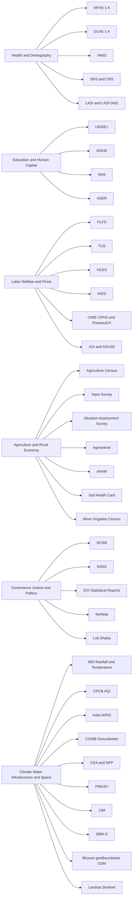
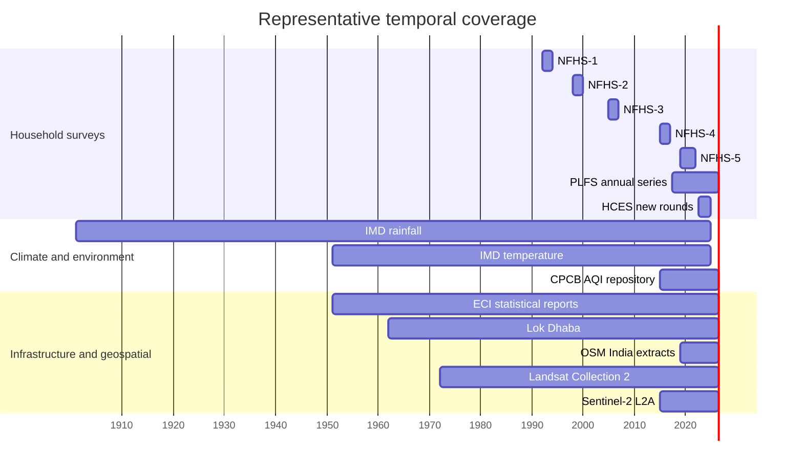

# Indian Data Guide Research Report

## Executive summary

India’s data ecosystem is unusually rich, but it is spread across several different “regimes” of access. The strongest anchors for a national data guide are the NSO/MoSPI microdata archive, Census/ORGI, the Open Government Data platform, mission dashboards run by ministries, IIPS/DHS-style health microdata, election and court portals, and a smaller set of research datasets and subscription products such as IHDS and CMIE. For a public-facing website, the most important design task is therefore not simply indexing datasets, but normalizing differences in access model, geography, time scale, documentation quality, and licensing. citeturn29search13turn6search7turn8search24turn28search10turn11search0turn10search6turn22search0turn22search1

I catalogued **72 datasets** across more than **20 broad categories**, including health, demographics, education, learning outcomes, labor, time use, household living standards, aging, agriculture, land and irrigation, enterprise and industry, macroeconomy, prices, crime, justice, elections, climate, air quality, water, energy, transport, infrastructure, sanitation, geospatial boundaries, and remote sensing. The overall pattern is clear. Microdata families such as NFHS, PLFS, HCES, ASI, ASUSE, and LASI are well documented and often downloadable after registration or application. Administrative dashboards such as HMIS, CPCB AQI, JJM, SBM-G, PMGSY, WRIS, CEA/NPP, and DGCA are often public and current, but their documentation is more heterogeneous. CMIE products are especially valuable but remain subscription-only. citeturn28search2turn34search2turn30search17turn30search7turn30search2turn22search3turn7search0turn13search1turn15search0turn15search1turn26search4turn14search8turn14search1turn14search9turn26search9turn22search1turn22search2

For a website guide, the best user experience will come from treating datasets as **discoverable records with strong metadata**, not as a flat directory of links. The most useful filters are: category tags, access type, geography, time coverage, frequency, update latency, format, and whether a dataset is survey microdata, administrative statistics, a dashboard, a PDF publication, or gridded geospatial data. A second layer should expose “related datasets” so users can move, for example, from NFHS to HMIS and SRS, or from Agriculture Census to Input Survey, Agmarknet, and Soil Health Card. That relational layer matters because many Indian data problems are solved with combinations of survey and administrative data rather than a single source. citeturn28search24turn7search0turn6search0turn25search1turn25search2turn5search0turn5search1

## How the ecosystem fits together

A practical way to understand Indian data is to organize it into six interacting clusters: large recurring survey/microdata programs, administrative monitoring systems, macro-statistical series, governance and justice data, mission dashboards, and geospatial/remote-sensing layers. Those clusters overlap heavily. For example, NFHS sits simultaneously in health, demographics, women and children, and district development. PLFS belongs to labor, household welfare, and macroeconomic monitoring. Agriculture Census belongs to land, farm structure, rural policy, and irrigation. IMD rainfall and CPCB AQI are environmental series, but they also feed agriculture, health, and disaster analysis. citeturn28search24turn34search6turn25search1turn12search0turn13search1

The temporal structure is also important for website design. Some datasets are periodic and wave-based, some are annual publications, some are monthly or daily operational systems, and some are continuous rolling repositories. Your interface should therefore expose time differently for each type: wave selector for survey series, year selector for publications, and date-range picker for dashboards or gridded environmental data. citeturn28search24turn34search2turn30search9turn12search0turn13search1turn14search8turn14search9

## Core comparison matrix

The table below is the “front page” comparison view I would put on the website. It emphasizes dataset role, size tier, access type, and the main variables users commonly look for.

| Dataset | Broad categories | Size tier | Access level | Key variables or indicators | Why it matters |
|---|---|---:|---|---|---|
| NFHS-5 | health; demographics; nutrition; gender | Very large | Registration / licensed microdata | fertility, family planning, child anthropometry, vaccination, anemia, blood pressure, diabetes, district IDs citeturn28search2turn28search9 | The flagship modern district-level household health source |
| HMIS | health systems; maternal-child health; administrative data | Very large | Public portal | births, deaths, patient counts, immunization, drug stocks, service use citeturn7search0turn7search12 | High-frequency routine health reporting |
| UDISE+ | school education; infrastructure; teachers | Very large | Public dashboard; microdata request | school profile, infrastructure, teachers, enrolment, exam results citeturn8search24turn31search20 | Core school-system database |
| PLFS annual | labor; wages; human capital | Large | Registration / download | WPR, LFPR, UR, industry, occupation, earnings, hours citeturn34search2turn34search12 | India’s baseline labor-market dataset |
| HCES 2023-24 | consumption; poverty; prices | Very large | Registration / download | MPCE, quantity and value of items, food and non-food sections citeturn30search9turn30search5turn35search8 | Essential for welfare measurement and CPI weights |
| Agriculture Census | agriculture; land; rural structure | Large | Public tables and reports | operational holdings, size class, irrigation status, land use citeturn25search0turn25search1 | Core farm structure series |
| Agmarknet | market prices; agriculture; mobility of produce | Very large | Public dashboard | mandi, commodity, arrivals, wholesale prices, dates citeturn5search0turn5search6 | Daily agricultural price discovery |
| Crime in India | crime; policing; gender violence | Large | Public PDF reports | IPC/SLL cases, victims, state/UT, city, crime type citeturn10search0 | Official annual crime reference |
| NJDG | justice; courts; governance | Very large | Public dashboards | instituted, pending, disposed, case type, delay reasons citeturn10search3turn10search6 | Live judicial system observatory |
| ECI statistical reports | elections; turnout; political competition | Medium | Public PDF/XLSX | electors, turnout, candidates, votes, winners, constituency results citeturn11search0turn11search26 | Official election results archive |
| IMD gridded rainfall | climate; agriculture; disaster; hydrology | Very large | Public download | daily rainfall, lat-long grid, long historical series citeturn12search0turn12search12 | The standard national rainfall grid |
| CPCB AQI repository | air quality; health; urban environment | Very large | Public portal | AQI, PM2.5, PM10, NO2, O3, station, city, timestamp citeturn13search1turn13search5 | Real-time and historical air pollution analytics |
| India-WRIS reservoir module | water; irrigation; hydrology | Medium | Public portal | reservoir level, storage, date, inflow/outflow, location citeturn14search4turn14search8 | Daily water storage monitoring |
| CEA installed capacity | energy; infrastructure | Medium | Public PDF/XLS | source, sector, state, installed MW, month citeturn14search1turn14search12 | Official electricity capacity benchmark |
| PMGSY dashboard | roads; rural infrastructure | Medium | Public dashboard | roads sanctioned/completed, habitations, km, financial progress citeturn26search4turn26search16 | Best source on all-weather rural road connectivity |
| JJM dashboard | water; rural services; governance | Medium | Public dashboard | households, tap connections, panchayat, village, certification status citeturn15search0turn15search8 | Directly useful for service-delivery tracking |
| Census PCA 2011 | demographics; labor; literacy; settlement hierarchy | Very large | Public tables | population, sex, literacy, workers, SC/ST, households citeturn27search0turn27search2 | Small-area demographic base layer |
| Landsat Collection 2 | remote sensing; land; water; urban growth | Very large | Open download | multispectral scenes, surface reflectance, QA bands, geometry citeturn17search0turn17search4 | Longest consistent Earth-observation record used in India work |
| Sentinel-2 L2A | remote sensing; crop and urban monitoring | Very large | Open download | 10m/20m/60m spectral bands, scene metadata, geometry citeturn17search1turn17search5 | High-resolution optical satellite workhorse |
| CMIE CPHS | household panel; incomes; employment; consumption | Very large | Paid subscription | household and member records, repeated panel waves, welfare and labor fields citeturn22search1turn22search21 | The main private high-frequency household panel |

## Survey and panel catalog

The next four tables are the detailed catalog. “Access” and “Docs” citations are intended to function as the direct landing pages a website would surface. “Size tier” is a practical website-tier label rather than a precise storage measure.

| Dataset | Categories | Host | Access / docs | Size tier | Representative fields | Formats / access / update | Coverage / example use |
|---|---|---|---|---:|---|---|---|
| NFHS-1 1992-93 | health; demographics; fertility | IIPS / MoHFW / DHS-WB | Access citeturn28search6 Docs citeturn28search23 | Large | fertility, family planning, mortality, maternal and child health | DHS-style microdata; licensed request; one wave | India, 24 states + Delhi, 1992–93; foundational baseline for modern Indian health analysis citeturn28search6turn28search23 |
| NFHS-2 1998-99 | health; demographics; nutrition | IIPS / MoHFW / DHS-WB | Access citeturn28search1 Docs citeturn28search18turn28search8 | Large | fertility, mortality, family planning, nutrition, health care | DHS-style microdata; licensed request; one wave | India, 26 states, 1998–99; widely used in reproductive and child health studies citeturn28search1turn28search18 |
| NFHS-3 2005-06 | health; HIV; nutrition; gender | IIPS / MoHFW / DHS-WB | Access citeturn28search0 Docs citeturn28search5turn29search6 | Very large | HIV testing, fertility, health care use, nutrition, women’s status | DHS microdata; licensed request; one wave | India, all 29 states, 2005–06; used heavily in public-health and nutrition work citeturn28search0turn28search5 |
| NFHS-4 2015-16 | health; district data; NCDs | IIPS / MoHFW / DHS-WB | Access citeturn28search24 Docs citeturn28search11 | Very large | district indicators, child growth, sanitation, women’s health, biomarker modules | DHS microdata; licensed request; one wave | India, all states/UTs and district-level estimates, 2015–16 citeturn28search24turn28search11 |
| NFHS-5 2019-21 | health; demographics; district development | IIPS / MoHFW / DHS-WB | Access citeturn28search17 Docs citeturn28search2turn28search9 | Very large | fertility, ANC, immunization, BMI, anemia, blood pressure, glucose | DHS microdata + DDI/XML/JSON; licensed request; irregular multi-year wave | India, states/UTs and 707 districts, 2019–21; core current household health source citeturn28search2turn28search9 |
| DLHS-1 1998-99 | health; district statistics; reproductive health | MoHFW / IIPS | Access / round confirmation citeturn29search26 Docs / scope review citeturn29search10 | Large | reproductive health, family planning, district indicators | historical survey documentation; public references; wave-based | India, district-level program orientation, 1998–99 citeturn29search26turn29search10 |
| DLHS-2 2002-04 | health; district statistics | MoHFW / IIPS / GHDx | Access citeturn29search2 Docs citeturn29search26 | Very large | household health service use, reproductive and child health | microdata access listed; wave-based | India, 2002–05 metadata coverage; district-level RCH evidence citeturn29search2turn29search26 |
| DLHS-3 2007-08 | health; service delivery; district comparisons | MoHFW / IIPS | Access / scale note citeturn29search23 Docs / round listing citeturn29search26 | Very large | MCH indicators, family planning, service quality, district comparisons | survey microdata / documentation; wave-based | India, all districts, 2007–08 citeturn29search23turn29search26 |
| DLHS-4 2012-13 | health; district statistics; facility survey | MoHFW / IIPS / GHDx | Access citeturn28search7 Docs citeturn29search26 | Large | district health indicators, facility-linked measures | microdata listed as downloadable in catalog; wave-based | India, 2012–14 metadata coverage; commonly paired with AHS/NFHS for district work citeturn28search7turn29search26 |
| HMIS | routine health information; facilities; maternal-child health | MoHFW | Access citeturn7search0turn7search7 Docs citeturn7search12turn7search9 | Very large | births, deaths, immunization, patient counts, drug stocks, infrastructure | portal tables; public reports; monthly / near-real-time | India to block/sub-district in many outputs; examples include external consistency and RHIS studies citeturn7search12turn7search6 |
| SRS Statistical Reports | demography; fertility; mortality | ORGI / Census | Access citeturn6search0 Docs citeturn6search4turn6search14 | Medium | crude birth rate, crude death rate, infant mortality, age composition | PDF reports; annual | India and larger states/UTs, long-running annual series citeturn6search0turn6search10 |
| CRS Vital Statistics | civil registration; births; deaths | ORGI / Census | Access citeturn6search1 Docs citeturn6search9turn6search13 | Medium | registered births, registered deaths, infant deaths, sex ratios | PDF reports; annual | India, states and registration-system outputs; vital-statistics benchmark citeturn6search1turn6search9 |
| LASI Wave 1 | aging; health; economics; social support | IIPS / Harvard / USC | Access / study page citeturn22search3 Docs / cohort description citeturn22search7turn22search15 | Very large | household, individual, community modules; health, cognition, work, family support | survey files; registration-dependent; 5-year planned waves | India, 45+ population across all states/UTs, Wave 1 fieldwork 2017–19 citeturn22search3turn22search11 |
| LASI-DAD | dementia; cognition; aging; biomarkers | USC / LASI-DAD | Access citeturn23search0 Docs citeturn23search1turn23search8 | Large | cognitive tests, informant interview, geriatric assessment, biomarkers | registration + DUA; specialized follow-on wave | India, LASI subsample aged 60+, used in dementia and cognitive-aging papers citeturn23search13turn23search3 |
| UDISE+ | school education; infrastructure; teachers | DoSE&L / MoE | Access citeturn8search24turn8search0 Docs citeturn31search20turn31search3 | Very large | school profile, infrastructure, teachers, enrolment, exam results | public dashboard; microdata request portal; annual school-year cycle | India, school-level system; best for school infrastructure and enrolment mapping citeturn8search4turn31search20 |
| AISHE | higher education; universities; finance | Ministry of Education | Access citeturn8search1 Docs citeturn8search9turn31search24 | Large | teachers, student enrolment, programmes, exam results, finance, infrastructure | web portal + final reports; annual | India, institution-level higher education since 2010–11 citeturn8search1turn31search2 |
| NAS 2021 | learning outcomes; assessment | NCERT / PARAKH / MoE | Access citeturn9search1 Docs citeturn9search0turn9search6 | Large | test scores, pupil questionnaire, school questionnaire, teacher questionnaire | dashboard and report card; periodic | India, 720 districts, 2021 round; strongest official learning outcome assessment citeturn9search0turn9search6 |
| ASER | learning outcomes; rural education; household survey | ASER Centre / Pratham | Access citeturn8search3 Docs citeturn8search7turn8search15 | Large | school enrolment, reading, arithmetic, school report card items | reports / downloadable tables; annual or thematic rounds | Rural India; essential counterpoint to administrative school data citeturn8search3turn8search19 |
| PLFS annual 2023-24 | labor; employment; wages | NSO / MoSPI | Access citeturn34search2 Docs citeturn34search3turn34search12 | Very large | CWS, activity status, industry code, occupation code, earnings, hours | microdata + DDI/XML/JSON; registration; annual | India, rural and urban, July 2023–June 2024 citeturn34search2turn34search3 |
| PLFS quarterly / calendar 2025 | labor; short-term urban monitoring | NSO / MoSPI | Access citeturn34search1turn34search4 Docs citeturn34search0 | Very large | person and household files, status codes, employment indicators | microdata + DDI; registration; quarterly / annualized calendar release | India, Jan–Dec 2025 or quarterly extracts; best for labor turning points citeturn34search1turn34search4 |
| Time Use Survey 2024 | time use; unpaid work; care economy | NSO / MoSPI | Access citeturn37search0 Docs citeturn37search2turn37search3 | Large | paid work, unpaid care, domestic services, learning, leisure, self-care | microdata + DDI/XML/JSON; registration; episodic | India, 2024; strongest official source for care and unpaid work citeturn37search0turn37search3 |
| HCES 2022-23 | consumption; welfare; CPI weights | NSO / MoSPI | Access citeturn30search17 Docs citeturn30search1turn30search13 | Very large | household sections, food and non-food item quantity/value, MPCE | microdata + DDI; registration; special round | India, 2022–23; key post-pandemic consumption benchmark citeturn30search17turn30search1 |
| HCES 2023-24 | consumption; poverty; price statistics | NSO / MoSPI | Access citeturn30search9 Docs citeturn30search5turn35search8 | Very large | item-level quantity/value, fractile classes of MPCE, state and all-India summaries | microdata + DDI + final report; registration; annualized special release | India, 2023–24; currently one of the most policy-relevant household datasets citeturn30search9turn35search8 |
| IHDS-I 2004-05 | household welfare; caste; gender; education | UMD / NCAER | Access citeturn22search0turn22search4 Docs citeturn22search8 | Very large | health, education, employment, assets, marriage, fertility, social capital | downloadable academic survey files; free registration | India, 41,554 households; panel baseline with exceptionally broad topics citeturn22search0turn22search8 |
| IHDS-II 2011-12 | panel data; household change over time | UMD / NCAER | Access citeturn22search20 Docs citeturn22search8 | Very large | re-interviews, income, consumption, agriculture, education, government programs | free academic access; panel wave | India, 42,152 households; ideal for medium-run panel analysis citeturn22search20turn22search16 |
| CMIE CPHS | household panel; labor; incomes | CMIE | Access citeturn22search1turn22search17 Docs / handbook citeturn22search13turn22search21 | Very large | anonymized household and member records, repeated waves, welfare and labor fields | proprietary subscription; continuous panel waves | India, 170k+ households since 2014; heavily used for high-frequency labor and welfare work citeturn22search1turn22search9 |
| CMIE ProwessDX | firms; finance; market data | CMIE | Access citeturn22search2turn22search14 Docs citeturn22search6 | Very large | P&L, balance sheet, ratios, cash flow, share prices, corporate actions | proprietary subscription; regularly updated | India, 50k+ companies, history back to 1990 in many series citeturn22search14turn22search10 |
| ASUSE 2023-24 | informal enterprises; MSMEs; services; trade | NSO / MoSPI | Access citeturn30search2 Docs citeturn30search6 | Large | establishment characteristics, output, value added, employment, operating variables | microdata + DDI; registration; annual | India, unincorporated non-agricultural establishments, 2023–24 citeturn30search2turn30search10 |
| ASI 2023-24 | manufacturing; factories; industrial structure | NSO / MoSPI | Access citeturn30search7 Docs citeturn30search19turn30search15 | Very large | identification, ownership, fixed assets, working capital, labor cost, outputs, inputs | microdata + DDI/XML/JSON; registration; annual | India, registered factory sector, 2023–24; standard for organized manufacturing work citeturn30search7turn36search8 |
| National Accounts Statistics | GDP; GVA; macroeconomy | MoSPI / eSankhyiki | Access citeturn21search0turn21search6 Docs citeturn21search23 | Medium | GDP, GVA, national income, sectoral aggregates | portal tables/downloads; official series | India, macro time series; macro anchor for national and state analysis citeturn21search6turn21search3 |
| IIP | industry; business cycle | MoSPI / eSankhyiki | Access citeturn21search20 Docs citeturn21search0 | Medium | base year, category, sub-category, index, growth rate | portal download; monthly | India, monthly industry tracker; useful for cyclical analysis citeturn21search20turn21search0 |
| CPI Combined | inflation; prices; household welfare | MoSPI / eSankhyiki | Access citeturn20search1turn20search3 Docs citeturn20search12 | Medium | rural, urban, combined CPI; groups/sub-groups; item-wise and state-wise indices | portal + press releases; monthly | India and states/UTs; oil for CPI-linked analyses and deflators citeturn20search5turn20search17 |
| WPI | inflation; producer prices; industry | Office of Economic Adviser | Access citeturn19search3turn19search7 Docs citeturn19search17 | Medium | WPI/PPI series, commodity groups, linked base years | downloadable data; monthly | India, long multi-base price series; production-side inflation lens citeturn19search3turn19search7 |
| RBI DBIE | finance; banking; macro; fiscal | RBI | Access / download capabilities citeturn19search4turn19search8 Docs / portal change notice citeturn19search15 | Large | real sector, corporate sector, financial sector, financial markets, external sector, public finance | downloadable Excel/CSV/PDF; official time-series database | India-wide macro-financial series; default reference for finance-facing data guides citeturn19search4turn19search8 |

## Administrative, market, governance, environment, and geospatial catalog

| Dataset | Categories | Host | Access / docs | Size tier | Representative fields | Formats / access / update | Coverage / example use |
|---|---|---|---|---:|---|---|---|
| Agriculture Census 2015-16 | agriculture; land; irrigation | Agriculture Census Division | Access citeturn25search0turn25search1 Docs citeturn25search21 | Large | number and area of operational holdings, size class, irrigation, tenancy, land use | public tables and reports; quintennial | India and states; canonical farm-structure baseline citeturn25search1turn25search5 |
| Agriculture Census 2021-22 | agriculture; land structure | Agriculture Census Division | Access / operational guideline citeturn25search15 Docs / portal citeturn25search4 | Large | operational holdings and census process fields | public reports rolling out; quintennial | India, reference year 2021–22; newest agriculture-census cycle citeturn25search15 |
| Input Survey 2016-17 | farm inputs; irrigation; crop practices | Agriculture Census Division | Access citeturn25search2 Docs citeturn25search9 | Large | irrigated/unirrigated crops, fertilizers, manures, pesticides, holder identifiers | public report/manual; periodic | India, 2016–17; operational holding input-use evidence citeturn25search2turn25search9 |
| Input Survey 2022-23 | farm inputs; technology use | Agriculture Census Division | Access / manual and schedules citeturn25search6 Docs citeturn25search15 | Large | fertilizers, HYV/hybrid seeds, pesticides, bio-inputs, irrigation-linked use | public manual/reporting system; periodic | India, linked to latest Agriculture Census cycle citeturn25search6 |
| Situation Assessment of Agricultural Households 2019 | agriculture; incomes; debt; technology adoption | NSO / MoSPI | Access citeturn24search0 Docs / data dictionary citeturn24search2turn24search6 | Very large | household assets, income, consumption, indebtedness, farming practices, welfare-scheme access | microdata + DDI; registration; episodic | India, Jan–Dec 2019, 77th round; essential for farm household economics citeturn24search0turn24search6 |
| Cost of Cultivation of Principal Crops | agriculture; farm economics; MSP analysis | DES / DACFW | Access / official scheme notes citeturn25search3turn25search10 Docs citeturn33search5 | Large | crop-wise cost items, labor, machinery, fertilizer, A2+FL, C2-type cost constructs | official scheme and plot-level summaries; annual but lagged | India, multi-state crop-cost series; used by CACP and farm-cost research citeturn25search24turn33search6 |
| Agmarknet | agriculture; daily market prices; mandi arrivals | DACFW | Access citeturn5search0turn5search6 Docs / portal notes citeturn5search9turn5search15 | Very large | state, district, mandi, commodity, arrivals, min/modal/max price, date | public portal; near-daily | India-wide APMC-linked prices; indispensable for price transmission work citeturn5search12 |
| eNAM trade dashboard | agriculture; market integration; trade | SFAC / MoAFW | Access citeturn24search1turn24search5 Docs / factsheet citeturn24search3 | Very large | state, APMC, commodity, min/modal/max price, arrivals, traded quantity, unit, date | public dashboard; operational updates | India-wide electronic mandi network; useful for market-integration research citeturn24search1turn24search3 |
| Soil Health Card | agriculture; soils; nutrients | DACFW | Access citeturn5search1 Docs citeturn5search16turn5search25 | Large | N, P, K, S, micronutrients, organic carbon, pH, EC and related soil measures | public dashboard / application; periodic operational updates | India, farmer-holding and nutrient monitoring; useful for agro-environmental work citeturn5search22 |
| 6th Minor Irrigation Census | irrigation; water assets; village infrastructure | Ministry of Jal Shakti / OGD | Access citeturn5search29 Docs / example variable descriptions citeturn5search26 | Large | village, scheme type, ownership, social status, holding size, maintenance, utilization | zip/API via OGD; released under NDSAP | India, reference year 2017–18; valuable for village-level irrigation asset mapping citeturn5search29turn5search26 |
| Crime in India | crime; policing; gender; urban safety | NCRB | Access citeturn10search0 Docs / annual report structure citeturn32search4 | Large | offences by type, state/UT, victims, police categories, city tables | PDF annual report | India, annual; official crime baseline for media, policy, and research citeturn10search0 |
| Prison Statistics India | prisons; justice; incarceration | NCRB | Access citeturn10search4 Docs / parliamentary description citeturn10search11 | Medium | capacity, occupancy, prisoner composition, prison type, staff | PDF annual report | India, annual; basic prison system monitoring series citeturn10search11 |
| Accidental Deaths and Suicides in India | mortality; public safety; mental health | NCRB | Access citeturn10search2 Docs / NCRB site | Medium | suicides, accidental deaths, causes, state/UT, occupation categories | public annual report | India, annual; often combined with labor and health indicators in social risk analysis citeturn10search2 |
| NJDG | justice; courts; governance | eCourts / Department of Justice | Access citeturn10search3turn10search14 Docs citeturn10search6turn10search18 | Very large | instituted, pending, disposed, civil/criminal, case type, delay reasons | public dashboards; daily/near-real-time | India’s district/taluka and high-court case monitoring backbone citeturn10search16 |
| ECI General Election statistical reports | elections; turnout; constituency results | Election Commission of India | Access citeturn11search0 Docs / report structure citeturn11search26 | Medium | electors, voters, turnout, party-wise votes, successful candidates | PDF and XLSX report components; election-cycle | India, Lok Sabha elections over time; official reference archive citeturn11search0turn11search13 |
| ECI Assembly Election statistical reports | elections; states; constituency outcomes | Election Commission of India | Access citeturn11search10turn11search17 Docs citeturn11search26 | Medium | AC electors, voters, parties, candidates, winners, turnout | PDF and XLSX; election-cycle | State assembly elections, highly valuable for state politics and redistricting histories citeturn11search10turn11search17 |
| MyNeta candidate affidavits | elections; assets; criminality; candidate profiles | ADR / MyNeta | Access citeturn11search1turn11search18 Docs / methodology note citeturn11search8 | Large | assets, liabilities, education, criminal cases, constituency, party | web profiles; structured extraction possible; election-cycle | India, candidate-level transparency dataset derived from affidavits citeturn11search1 |
| Lok Dhaba | elections; legislative politics; history | TCPD / Ashoka University | Access citeturn11search19turn11search2 Docs citeturn11search6 | Large | election results, constituency history, candidate/party trajectories | downloadable datasets; research archive | India, Lok Sabha and Vidhan Sabha elections from 1962 onward; documented in ACM paper citeturn11search12 |
| IMD gridded rainfall | climate; hydrology; agriculture; disasters | IMD Pune | Access citeturn12search0turn12search12 Docs / Python package examples citeturn12search9turn12search13 | Very large | daily rainfall, lat-long grid, mm units | NetCDF and binary; public; updated annually | India, 0.25° daily grid, 1901–2024; widely used in hydro-climatic applications citeturn12search5 |
| IMD gridded temperature | climate; heat; agriculture | IMD Pune | Access citeturn12search1 Docs / package notes citeturn12search9turn12search13 | Very large | daily max/min temperature, 1° grid, lat-long | binary and related tools; public; updated annually | India, 1951–2024; important for heat, crop, and mortality work citeturn12search1 |
| CPCB AQI repository / CAAQMS | air quality; health; urban environment | CPCB | Access citeturn13search1turn13search6 Docs / download workflow citeturn13search5 | Very large | AQI, PM2.5, PM10, NO2, O3, station, city, timestamp | public repository; real-time and historical | India-wide station network; increasingly used in open-source archives and quality studies citeturn13search3turn13search4 |
| India-WRIS reservoir module | water; dams; irrigation | CWC / NWIC | Access citeturn14search8 Docs citeturn14search4 | Medium | reservoir name, storage, level, date, telemetry | public WebGIS dashboard; daily | India reservoirs with daily level and storage data citeturn14search4 |
| CGWB groundwater level monitoring | groundwater; hydrology; climate adaptation | CGWB / NWIC | Access citeturn12search3turn12search11 Docs / data-use examples citeturn12search7turn12search18 | Large | monitoring station, quarter, pre/post monsoon groundwater level | web portal through WRIS/WIMS; quarterly monitoring | India, long-running national groundwater network citeturn12search22 |
| CEA installed capacity reports | energy; electricity | CEA | Access citeturn14search1turn14search12 Docs / related charts citeturn14search12 | Medium | installed MW by source, sector, state/region, month | PDF and Excel; monthly | India power capacity backbone; official capacity benchmark for all energy guides citeturn14search1 |
| National Power Portal / GRID-INDIA daily generation | energy; grid operations; demand | NPP / GRID-INDIA | Access citeturn14search9turn14search6 Docs / dashboard structure citeturn14search2 | Medium | daily generation, demand, transmission, source-wise splits | dashboard; daily operational updates | India; best public demand-generation snapshot for electricity operations citeturn14search9 |
| Road Accidents in India | transport safety; injuries; fatalities | MoRTH | Access citeturn14search3turn32search4 Docs / report appendix structure citeturn32search4 | Large | accidents, deaths, injuries, road category, weather, rule violation, road user type | PDF annual report | India, annual official road-safety series citeturn14search3turn32search4 |
| PMGSY dashboard | roads; rural infrastructure; accessibility | Ministry of Rural Development | Access citeturn26search4turn26search16 Docs / mission status note citeturn26search24 | Medium | kilometers, roads sanctioned/completed, habitations covered, project summary, state performance | public dashboard; regularly refreshed | India, rural road build-out progress under PMGSY citeturn26search4 |
| DGCA monthly traffic statistics | aviation; transportation; freight | DGCA | Access citeturn26search9 Docs / site and reuse notes citeturn26search1turn26search5 | Medium | city-pair passengers, freight, mail, carrier-wise traffic | public PDFs; monthly | India domestic aviation, especially strong from mid-2010s onward citeturn26search9turn26search5 |
| Jal Jeevan Mission dashboard | water; rural service delivery | Department of Drinking Water & Sanitation | Access citeturn15search0turn15search8 Docs / mission overview citeturn15search4 | Medium | state, scheme, panchayat, village, households, tap-water coverage, Har Ghar Jal status | public dashboard; operationally refreshed | Rural India, village and panchayat service-delivery tracking citeturn15search0 |
| SBM-G dashboard | sanitation; rural services; ODF monitoring | DDWS | Access citeturn15search1 Docs citeturn15search5turn15search17 | Medium | villages, districts, blocks, GPs, ODF Plus status, verification stages | public dashboard; operationally refreshed | Rural India sanitation progress and ODF-Plus tracking citeturn15search1turn15search13 |
| Census PCA 2011 | demographics; literacy; workers | ORGI / Census of India | Access citeturn27search0turn27search3 Docs citeturn27search2 | Very large | population, sex ratio, literacy, workers, households, SC/ST | public query tools and tables | India down to village/town, 2011; core baseline geography table citeturn27search0turn27search2 |
| District Census Handbook / Village Directory | village amenities; small-area demographics | ORGI / Census of India | Access citeturn27search1turn27search21 Docs / content description citeturn27search7turn27search11 | Very large | village area, households, amenities, roads, power, medical, education | PDFs and district handbooks | India, 2011 census district books; excellent for rural amenities and settlement studies citeturn27search18 |
| Bhuvan thematic datasets | geospatial; land use; hydrology; hazards | NRSC / ISRO | Access citeturn16search0turn16search5 Docs citeturn16search8 | Very large | LULC, urban land use, wasteland, water bodies, flood layers, geomorphology | GIS layers, OGC services, clip-and-ship; public | India-wide thematic spatial layers; used constantly in GIS workflows citeturn16search19 |
| Wastelands Atlas 2019 | land; ecology; geospatial | Department of Land Resources / NRSC | Access citeturn16search9 Docs citeturn16search1turn16search17 | Medium | state and district-wise wasteland classes, 23 classes | downloadable atlas and district/state sections | India, 2019 atlas; strong for land-degradation analysis citeturn16search9 |
| geoBoundaries India | admin boundaries; GIS | geoBoundaries / William & Mary geoLab | Access citeturn16search2 Docs citeturn16search6 | Medium | ADM0–ADMn geometries, metadata, licensing | open files, CC BY 4.0 / ODbL variants | India administrative boundaries; excellent open-license boundary layer when official shapefiles are limited citeturn16search2 |
| OpenStreetMap India extract | roads; POIs; transport; GIS | OSM / Geofabrik | Access citeturn16search7 Docs citeturn16search3turn16search15 | Very large | roads, rail, water, forests, POIs, routeable network | PBF and shapefiles; open OSM ecosystem | India extracts with rolling updates; indispensable for web maps and routing layers citeturn16search11 |
| Landsat Collection 2 | remote sensing; land; water; urban change | USGS / NASA | Access citeturn17search0turn17search12 Docs citeturn17search4 | Very large | multispectral imagery, surface reflectance, QA bands, geometry | open downloads via USGS portals and cloud | Global including India; long historical series for land-change analysis citeturn17search0turn17search8 |
| Sentinel-2 L2A | remote sensing; crop and vegetation monitoring | Copernicus / ESA | Access citeturn17search1 Docs citeturn17search5turn17search17 | Very large | 13 spectral bands, scene metadata, 5-day revisit, geometry | Copernicus Data Space; open with service rules | Global including India; high-resolution optical workhorse for agriculture and urban studies citeturn17search21 |

## Website architecture recommendations

The site should be built around a **dataset record schema** rather than a blog-style directory. Each record should have at least these fields: canonical title, short title, alternative abbreviations, category tags, source institution, host portal, access URL, documentation URL, access type, license, machine-readable formats, publication formats, update frequency, last known update, geographic unit, temporal unit, time coverage start/end, representative variables, file count or module count, size tier, related datasets, and example uses. That structure is what makes cross-dataset filtering and relationship browsing possible.

For tags, I would use a hybrid system with **broad subject tags** and **technical tags**. Broad tags should include health, education, labor, women and children, agriculture, firms, prices, crime, elections, justice, climate, water, energy, transport, sanitation, housing, geospatial, remote sensing, and macroeconomy. Technical tags should include household survey, panel, microdata, dashboard, PDF report, API, daily, monthly, annual, district-level, village-level, geospatial vector, raster grid, and restricted access. This lets users search either substantively or operationally.

The most important filters are not all equal. The website’s default filter bar should emphasize: **category, geography level, time coverage, access type, format, and update frequency**. A second row can hold sector source filters such as MoSPI, Census/ORGI, MoHFW, Agriculture, RBI, NCRB, ECI, MoRTH, CEA, water, environment, and academic archive. I would also add a **“good starting dataset”** flag for newcomers and a **“best current district source”** flag for users doing comparative district analysis.

Because documentation varies so much, each record should include a short editorial field called **“What this is best for”**, another called **“Main limitations”**, and a third called **“Pairs well with”**. For example, NFHS-5 pairs well with HMIS and SRS; Agriculture Census pairs well with Input Survey, Agmarknet, and IMD rainfall; CPCB air quality pairs well with Census PCA, road data, and health outcomes; ECI report tables pair well with MyNeta or Lok Dhaba.

I would also recommend one small but powerful convenience feature: a **representative field glossary**. Users often want to know whether a dataset has district codes, household IDs, crop identifiers, or pollutant station IDs before clicking through. A short, standardized field preview solves that problem. In practice, many Indian portals bury this information inside PDFs, DDI pages, or dashboard UIs; bringing it up front is one of the highest-value editorial services your site can provide.

Finally, the site should show **access friction honestly**. Use badges such as “Open download,” “Public dashboard,” “Registration required,” “Data-use agreement,” “Request-only,” and “Paid subscription.” That single feature will save users time and sharply improve trust, especially for datasets like CMIE, some IIPS or DHS-style microdata, and mission dashboards that are public but not always packaged as downloadable open files. citeturn22search1turn22search2turn28search17turn23search0turn8search24turn26search4turn15search0

The biggest caveat is that some Indian government resources are excellent in substance but inconsistent in packaging. A number of administrative systems expose rich data through dashboards and downloadable PDFs while offering weaker metadata, versioning, or API documentation than power users might want. The best website guide should therefore distinguish clearly between “publicly viewable,” “clean downloadable files,” and “fully documented reusable dataset.” Making that distinction explicit will be more useful to researchers than pretending all public portals are equally machine-readable. citeturn13search1turn15search0turn15search1turn26search4turn14search9